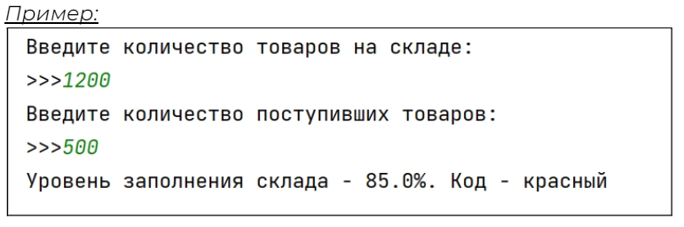

## [Задание 1.1 - Допишите программу](#task_1)
## [Задание 1.2 - Заполненность склада](#task_2)
## [Задание 1.3 - Где мои премиальные](#task_3)
## [Задание 1.4 - Хорошая работа, оплачивается хорошо](#task_4)
## [Задание 1.5 - Рейтинг это важно](#task_5)

#### [***Ссылка на тестирующую систему***](https://contest.yandex.ru/contest/42940/problems/) 
#### [_Ссылка на онлайн интерпретатор_](https://www.online-python.com/)
_________________________________________
_________________________________________

### Задание 1 - _Допишите программу_ <a name="task_1"></a>
Вам достался недописанный скрипт от разработчика Васи который ушёл работать в Moogle.

Закончите скрипт рассчитывающий скидку на товар в зависимости от срока хранения товара.
Если товар хранится на складе меньше 15 дней скидку делать не нужно,
если от 15 до 30 дней скидка 5 %, если свыше 30 дней скидка 10%.
Программа должна вывести сначала имя товара, а затем цену на новой строке.

#### Прекод:
```python
product = input('Введите имя товара\n>>>')
price = int(input('Цена товара\n>>>'))
storage_time = int(input('Введите время хранения товара\n>>>'))
if storage_time >= 15:
    # you code here
```

#### Пример программы:

_________________________________________
_________________________________________
### Задание 2 - _Заполненность склада_<a name="task_2"></a>
На склад постоянно поступают различные товары, но он не резиновый.  
Персоналу и руководителю очень важно знать текущий уровень заполнения склада.  
Напишите скрипт проверяющий текущий уровень заполнения склада с учетом текущего заполнения и поступления новых товаров. Программа должна выводить процент заполнения склада и **“код состояния”** склада:
уровень заполнений и код
- зелёный 40 %
- жёлтый 40-75 %
- красный 75 - 95 %
- чёрный 95% и выше
Объём склада равен 2000

#### Прекод:
```python
CAPACITY = 2000
```

#### Пример программы:

_________________________________________
_________________________________________
### Задание 3 - _Где мои премиальные_<a name="task_3"></a>
Для приложения UzonCourier нужно написать небольшой скрипт считающий заработную плату курьера за день.  
Пока нам нужен простой прототип.

Курьер склада получает **1500** руб. в день и может получить премию в зависимости от количества доставленных товаров:

- если доставил меньше 5, то премии нет
- если доставил 6-10 премия 10 % от ставки
- 10 и более 25 %

Скрипт должен позволять считать ЗП для неограниченного количества курьеров.

Для расчета программа получает на вход *имя* курьера, а затем количество доставок.
Чтобы закончить работу, введите вместо имени exit

*гарантируется, что все курьеры уникальны*

#### Прекод:
```python
SALARY = 1500
```


#### Пример программы:

_________________________________________
_________________________________________
### Задание 4 - _Хорошая работа, оплачивается хорошо_<a name="task_4"></a>
Необходимо доработать наш скрипт расчета премий и заработных плат.

Курьеры начали доставлять товары быстро, но стали небрежными и иногда портят товары при перевозке. Если есть факт хоть одного испорченного товара, курьер лишается премии.

**Используйте скрипт из предыдущего задания**, но теперь нам нужно вывести в конце общую сумму денег которую нужно заплатить курьерам. 
Еще мы забыли про налог **13%** который нужно вычесть из зарплаты каждого курьера.

Скрипт должен позволять считать ЗП для неограниченного количества курьеров и затем выводить общую сумму необходимую к выплате.

Для расчета программа получает на вход имя курьера, количество доставок и затем были ли испорченные заказы (**‘yes’** - были, любые остальные символы не было)

Чтобы закончить работу, введите вместо имени **exit**

*гарантируется, что все курьеры уникальны*


#### Прекод:
```python
SALARY = 1500
# your script
```

#### Пример программы:


**Подсказка**: в примере *Frodo* выполнил **1** доставку и все грузы целы с вычетом **13%** он получит **1305** рублей
*Flash* выполнил **10000** доставок, но где-то напортачил и соответственно не получит премии и также получит **1305** рублей в итоге оба они получат **1305 + 1305 = 2610**
_________________________________________
_________________________________________
### Задание 5 - _Рейтинг это важно_<a name="task_5"></a>
Начальник склада попросил вас проанализировать тексты отзывов о доставке, всё-таки клиенты должны быть довольны.

Каждый отзыв содержит текст и оценку.

Отзыв считается отрицательным если Оценка от **3** и **ниже** и в случае когда в отзыве присутствует негатив.

Отзыв, считается _негативным_ если содержит слова **_недоволен_**, **_кошмар_**

Значение оценки должно быть от одного до пяти, если пользователь вводит не то число нужно попросить его ввести заново пока не получиться.
Наш скрипт должен выводить **Positive)** если отзыв положительный и **Negative(** если отзыв отрицательный.
#### Прекод:
```python
'''
>>>Зерна крупные, равномерно обжарены, глянцевые. Кофе получается ароматный с легкой горчинкой, с нотками ореха и
шоколада. Для эспрессо великолепно!
>>>5

>>>Написано изготовитель Германия, а пришло изготовитель Нидерланды, он намного хуже
>>>1

>>>Играют хорошо, звук отличный. За такие деньги в самый раз. Недоволен только временем работы, заявлено 6 часов,
а по факту и 4 не выдерживает.
>>>4
'''
```

#### Пример программы:

