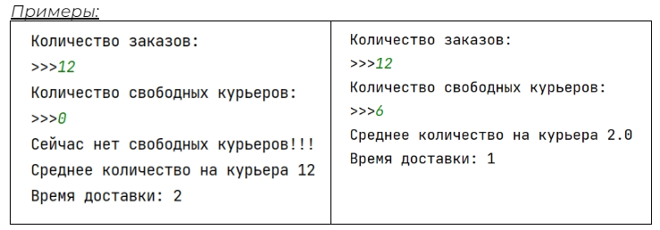
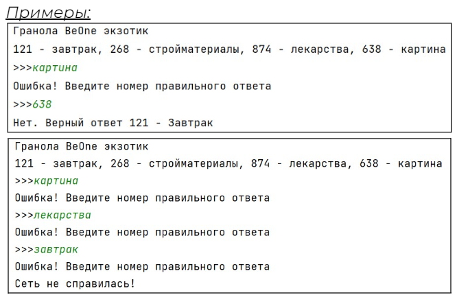
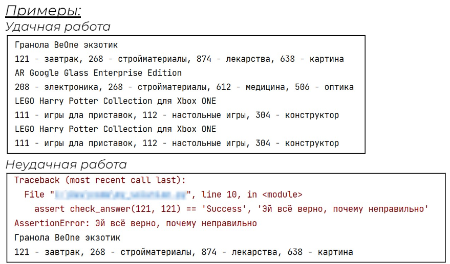
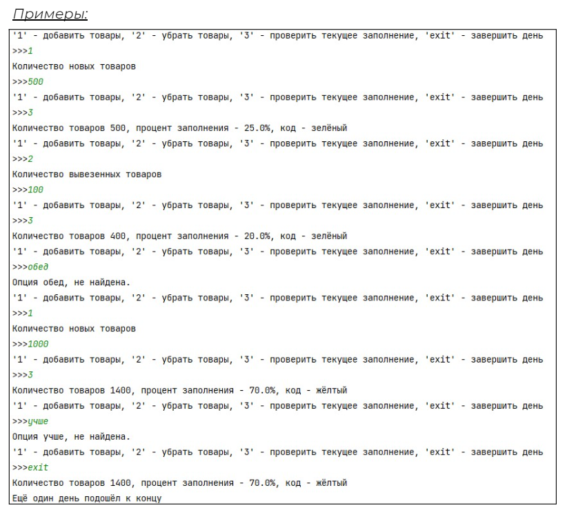

## [Задание 2.1 - Допишите программу](#task_1)
## [Задание 2.2 - Заполненность склада](#task_2)
## [Задание 2.3 - Где мои премиальные](#task_3)
## [Задание 2.4 - Хорошая работа, оплачивается хорошо](#task_4)
## [Задание 2.5 - Рейтинг это важно](#task_5)

#### [***Ссылка на тестирующую систему***](https://contest.yandex.ru/contest/42940/problems/) 
#### [_Ссылка на онлайн интерпретатор_](https://www.online-python.com/)
_________________________________________
_________________________________________

### Задание 1 - _Нужно больше курьеров?_ <a name="task_1"></a>
Посчитать сколько срочных заказов в среднем приходиться в данный момент на свободных курьеров. 
Это позволит спланировать время доставки. 
Программа должна выводить среднее значение и если оно больше **_3_** увеличивать время доставки в **_2 раза_**.

В скрипте уже есть ввод данных и обработка неверного ввода, 
вам нужно обработать ситуацию когда свободных курьеров нет (**_0_**). Если свободных курьеров нет, установите среднее количество заказов равным количеству заказов и выведите на экран сообщение ```Сейчас нет свободных курьеров!!!```

#### Прекод:
```python
delivery_time = 1
while True:
    orders = input('Количество заказов:\n>>>')
    try:
        orders = int(orders)
        break
    except ValueError:
        print('Нужно ввести целое число без лишних символов')
while True:
    couriers = input('Количество свободных курьеров:\n>>>')
    try:
        couriers = int(couriers)
        break
    except ValueError:
        print('Нужно ввести целое число без лишних символов')
```

#### Пример программы:


**Подсказка**: тип ошибки деления на ноль называется ```ZeroDivisionError```
_________________________________________
_________________________________________
### Задание 2 - _Нужно больше курьеров? Оптимизация_<a name="task_2"></a>
**_try except_** довольно дорогая операция поэтому оптимизируйте свой алгоритм в случае деления на ноль.

Используйте скрипт из предыдущего задания и оптимизируйте его. Найдите более оптимальный способ проверки, что количество курьеров больше нуля.


_________________________________________
_________________________________________
### Задание 3 - _Зоопарк ответов_<a name="task_3"></a>
Итак мы вернулись к скрипту тренировки нейронной сети. 

Заказчик изменил спецификацию и теперь нейросеть должна называть не название категории товара, 
а его уникальный номер в базе данных(**число**).

Если сеть вводит не число, например, «*завтрак*», то программа печатает: ```Ошибка! Введите номер правильного ответа```, пока не будет получено число.

Давайте дадим нашей сети 3 попытки.


#### Прекод:
```python
print('Гранола BeOne экзотик')
print('121 - завтрак, 268 - стройматериалы, 874 - лекарства, 638 - картина')
answer = 0

# you code here

if answer == 121:
    print('Абсолютно верно!')
elif answer == 0:
    print('Сеть не справилась!')
else:
    print('Нет. Верный ответ 121 - Завтрак')
```


#### Пример программы:

_________________________________________
_________________________________________
### Задание 4 - _Кидаемся исключениями_<a name="task_4"></a>
Итак, нас попросили написать функцию, которая будет принимать на вход номер правильного ответа, и ответ который мы будем получать от сети.

Так как эта функция будет встроена в другую программу, теперь при неправильно введенном формате ответа мы будем выбрасывать исключение ```ValueError``` c описанием '**Ответ должен передаваться в формате числа**' 
так при тестировании системы другие разработчики смогут отладить свои модули.

В случае верного ответа наша функция должна возвращать ```Success``` в случае неверного ```Fail```.
Вам нужно только заполнить тело функции


#### Прекод:
```python
def check_answer(right_answer: int, answer):
    if not isinstance(answer, int): # проверка, что answer это именно число
        pass
    # your code here
    return 'Fail'

# можно потестить
print('Гранола BeOne экзотик')
print('121 - завтрак, 268 - стройматериалы, 874 - лекарства, 638 - картина')
assert check_answer(121, 121) == 'Success', 'Эй всё верно, почему неправильно'
print('AR Google Glass Enterprise Edition')
print('208 - электроника, 268 - стройматериалы, 612 - медицина, 506 - оптика')
assert check_answer(208, 506) == 'Fail', 'Нейронка ответила неверно, проверь свой скрипт'
print('LEGO Harry Potter Collection для Xbox ONE')
print('111 - игры дла приставок, 112 - настольные игры, 304 - конструктор')
try:
    check_answer(111, 'конструктор')
except Exception as exc:
    assert isinstance(exc, ValueError), 'а здесь должно быть исключение ValueError'
    assert exc.args[0] == 'Ответ должен передаваться в формате числа'
```

#### Пример программы:


_________________________________________
_________________________________________
_________________________________________
_________________________________________
### Дополнительное задание - _Рейтинг это важно_<a name="task_5"></a>

Нам необходимо разработать скрипт заполнения склад товарами в течение дня, и отслеживающим уровень заполнения.

У нашего скрипта будут следующие действия:
- ‘**1**’ - добавить товары;
- ‘**2**’ - убрать товары;
- ‘**3**’ - проверить текущее заполнение;
‘**exit**’ завершить день.

Правила заполнения будут как и в прошлом задании уровень заполнений и код:
- _зелёный_ **40 %**
- _жёлтый_ **40-75 %**
- _красный_ **75 - 95 %**
- _чёрный_ **95% и выше**

Объём склада равен **2000**

**_Условия:_**

Если товаров добавляется больше чем есть места на складе, склад в этот день закрывается, а количество товара устанавливается максимальным. Выведите сообщение о том сколько товаров не поместилось на склад.

```Склад полностью заполнен, не поместилось - N товаров```

Если введена неверная опция, выведите сообщение:
```Опция X, не найдена.```

При попытке удалить со склада товаров больше чем есть в наличии, установить количество равным **0**.
```Количество товаров X, процент заполнения - Y%, код - Z```

После завершения дня вывести:
```
Количество товаров X, процент заполнения - Y%, код - Z
Ещё один день подошёл к концу
```

Скрипт должен работать пока не будет введено **exit** или пока не заполнится склад


#### Прекод:
```python
CAPACITY = 2000
load_percent = 0
current_capacity = 0
code = 'зелёный'
options = (
   "'1' - добавить товары, '2' - убрать товары, "
   "'3' - проверить текущее заполнение, 'exit' - завершить день"
)

# you code here

print('Ещё один день подошёл к концу')
```

#### Пример программы:

