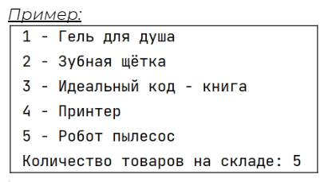
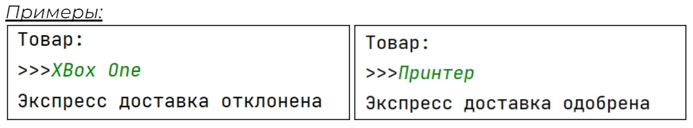
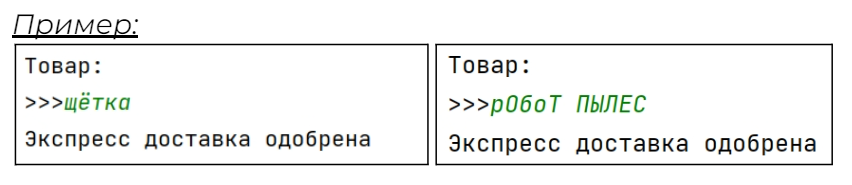
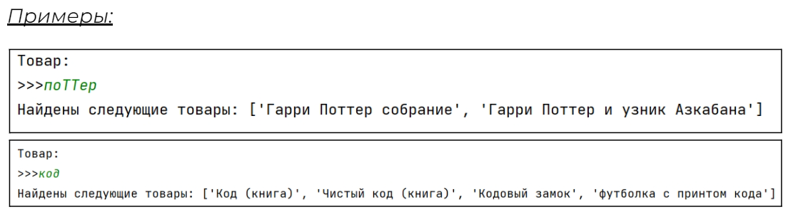
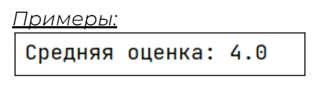

## [Задание 1.1 - Допишите программу](#task_1)
## [Задание 1.2 - Экспресс доставка](#task_2)
## [Задание 1.3 - Неточные запросы](#task_3)
## [Задание 1.4 - Где мой заказ](#task_4)
## [Задание 1.5 - Знак качества](#task_5)

#### [***Ссылка на тестирующую систему***](https://contest.yandex.ru/contest/43087/problems/) 
#### [_Ссылка на онлайн интерпретатор_](https://www.online-python.com/)
_________________________________________
_________________________________________

### Задание 1 - _Допишите программу_ <a name="task_1"></a>
Помогите кладовщику разложить товары на складе.

У нас есть список товаров поступивших на склад. Товары вносились в список по мере поступления. 
Для удобства, нам необходимо отсортировать наш список чтобы товары находились в **алфавитном** порядке, вывести удобное описание товаров с нумерацией и их общее количество.

Программа должна вывести товары нумеруя их начиная с единицы в алфавитном порядке и в конце вывести количество товаров на складе, как показано на картинке


#### Прекод:
```python
products = [
   'Гель для душа', 'Идеальный код - книга', 'Зубная щётка', 'Робот пылесос', 'Принтер'
]
# выполните сортировку списка
amount_products = 
# выведите все элементы с их порядковым номером
number = 1
for product in products:
   # ваш код
   number += 1
print('Количество товаров на складе:', amount_products)
```

#### Пример программы:

_________________________________________
_________________________________________
### Задание 2 - _Экспресс доставка_<a name="task_2"></a>
У нашего кладовщика очень много товаров и перед тем как подтвердить возможность экспресс-доставки, т.е. в день заказа, ему приходит запрос на наличие определённого товара.

Допишите скрипт проверяющий, что можно произвести экспресс доставку или же наоборот. Вывод должен быть как картинке.

Если товар найден выведите ```Экспресс доставка одобрена```   
В противном случае ```Экспресс доставка отклонена```

#### Прекод:
```python
products = [
   'Принтер', 'Сканер', 'Зубная щётка', 'Робот пылесос', 'Книга Гарри Поттер'
]
request = input('Товар:\n>>>')
# ваш код
```

#### Пример программы:

_________________________________________
_________________________________________
### Задание 3 - _Неточные запросы_<a name="task_3"></a>
Хьюстон у нас проблемы, наш предыдущий скрипт часто ошибается и не одобряет доставку, хотя товар на складе есть.

Как оказалось некоторые пользователи делают запросы в нижнем регистре, а некоторые вообще не пишут название целиком.
К примеру вместо "Книга Гарри Поттер" нам сделали запрос на "поттер".   
Теперь для проверки подходящих товаров нам придется перебрать все товары в списке и проверить нет ли там нужного.

Программа должна проверить все товары на совпадения и вынести вердикт.

Если товар найден выведите ```Экспресс доставка одобрена```  
В противном случае ```Экспресс доставка отклонена```

**_Примечание_**: в строках также можно использовать проверку вхождения к примеру код 
```python
"книга" in "книга Гарри Поттер"
``` 
выдаст ```True```

#### Прекод:
```python
products = [
   'Принтер', 'Сканер', 'Зубная щётка', 'Робот пылесос', 'Книга Гарри Поттер'
]
# метод lower преобразует все буквы строки в маленькие
request = input('Товар:\n>>>').lower()
find = False
for product in products:
   # ваш код
```


#### Пример программы:

_________________________________________
_________________________________________
### Задание 4 - _Где мой заказ_<a name="task_4"></a>
Наш скрипт стал работать лучше, но теперь у нас появилась другая проблема.   
Скрипт одобряет доставку даже когда товара на складе нет. 

Это случилось из-за неполных запросов. Действительно часто клиенты не знают точного названия товара и просто вбивают какие-то слова.
Теперь наш скрипт должен выводить все найденные товары, которые попадают под совпадение с запросом.

Наша программа должна выводить список найденных товаров или сообщение ```Ничего не найдено!```

#### Прекод:
```python
products = [
   'Код (книга)', 'Чистый код (книга)', 'Кодовый замок',
   'Гарри Поттер собрание', 'Гарри Поттер и узник Азкабана',
   'Принтер', 'футболка с принтом кода'
]
request = input('Товар:\n>>>').lower()
products_found = list()
for product in products:
   # ваш код
```

#### Пример программы:


_________________________________________
_________________________________________
### Задание 5 - _Знак качества_<a name="task_5"></a>
Отдел качества товаров ввёл новую форму записи для каждого отзыва на товар
```название товара - оценка```, оценка ведётся по 5 бальной шкале. 

Посчитайте среднюю оценку для товаров одной известной марки.

#### Прекод:
```python
iksiaomi_products = [
   'Mif Robot - 4', 'RedFi Note 5 - 3', 'RedFi Buds - 4', 'Iksiaomi 12X - 5'
]
```

#### Пример программы:

