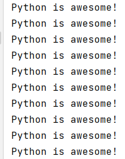
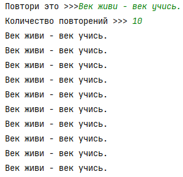
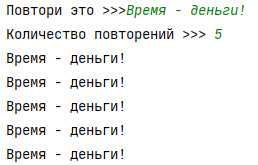
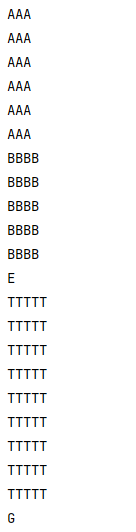
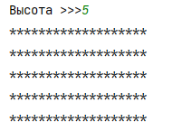
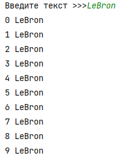
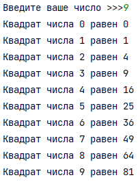
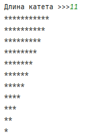

## [Задание 1.1 - Python is awesome!](#task_1)
## [Задание 1.2 - Повтори, что я сказал n раз](#task_2)
## [Задание 1.3 - Много букв](#task_3)
## [Задание 1.4 - Звёздный прямоугольник](#task_4)
## [Задание 1.5 - Нумеруем дубли](#task_5)
## [Задание 1.6 - Посчитай мои квадраты](#task_6)
## [Задание 1.7 - Звёздный треугольник](#task_7)

#### [_Ссылка на онлайн интерпретатор_](https://www.online-python.com/)
_________________________________________
_________________________________________

### Задание 1 - _Python is awesome!_ 
Напишите программу, которая выводит слова `Python is awesome!` (без кавычек) **10** раз.

**Формат выходных данных:**  
Программа должна вывести 10 раз текст `Python is awesome!`, каждый на отдельной строке

#### Примеры программы:
> 

_________________________________________
_________________________________________
### Задание 2 - _Повтори, что я сказал n раз_
Дано предложение и количество раз которое его надо повторить. Напишите программу, 
которая повторяет данное предложение нужное количество раз.

**Формат входных данных**  
В первой строке записано текстовое предложение, 
во второй — количество повторений.

**Формат выходных данных**  
Программа должна вывести указанное текстовое предложение нужное количество раз. 
Каждое повторение должно начинаться с новой строки.

#### Примеры программы:
> 
> 
_________________________________________
_________________________________________
### Задание 3 - _Много букв_
Напишите программу, которая использует ровно три цикла **for** для печати 
последовательности символов как в примере ниже:

**Формат выходных данных:**  
Программа должна вывести члены данной последовательности.

#### Пример программы:
> 

_________________________________________
_________________________________________
### Задание 4 - _Звёздный прямоугольник_
На вход программе подается натуральное число **n**. 
Напишите программу, которая печатает звездный прямоугольник размерами **_n×19_**.

**Формат входных данных:**  
На вход программе подается натуральное число **n∈[1;20]** — высота звездного прямоугольника.

**Формат выходных данных:**  
Программа должна вывести звездный прямоугольник размерами **n×19**.

#### Пример программы:
> 

_________________________________________
_________________________________________
### Задание 5 - _Нумеруем дубли_
Напишите программу, которая считывает одну строку текста и выводит **10** строк, 
пронумерованных от **0** до **9**, каждая с указанной строкой текста.

**Формат входных данных:**  
На вход программе подается одна строка текста.

**Формат выходных данных:**  
Программа должна вывести десять строк в соответствии с условием задачи.

#### Пример программы:
> 

_________________________________________
_________________________________________
### Задание 6 - _Посчитай мои квадраты_
На вход программе подается натуральное число **n**.  
Напишите программу, которая для каждого из чисел от **0** до **n** (включительно) выводит фразу: 
«Квадрат числа [**число**] равен [**число**]» (_без кавычек_).

**Формат входных данных:**  
На вход программе подается натуральное число **n**.

**Формат выходных данных:**  
Программа должна вывести текст в соответствии с условием задачи.

#### Пример программы:
> 

_________________________________________
_________________________________________
### Задание 7 - _Звёздный треугольник_
На вход программе подается натуральное число **n** (_n≥2_) – катет прямоугольного равнобедренного треугольника.  
Напишите программу, которая выводит звездный треугольник в соответствии с примером.

**Формат входных данных:**  
На вход программе подается одно натуральное число **n**(n≥2).

**Формат выходных данных:**  
Программа должна вывести треугольник в соответствии с условием задачи.

#### Пример программы:
> 

_________________________________________
_________________________________________