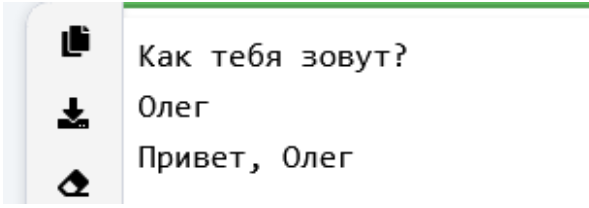
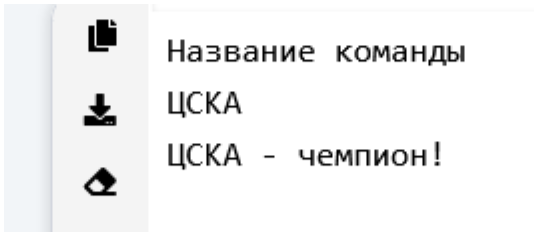
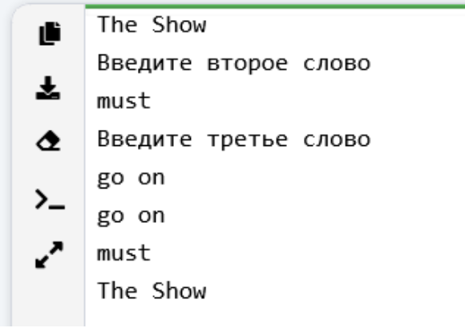
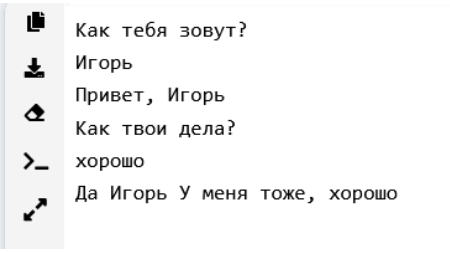

### Задание 1 - _Звёздный треугольник_
Напишите программу, которая печатает треугольник, 
состоящий из звездочек (*) по строкам:
#### Прекод:
```
*
**
***
****
*****
******
*****
****
***
**
*
```
_________________________________________
_________________________________________
### Задание 2 - _Давайте знакомиться_
На вход программе подается строка текста – имя человека. 
Напишите программу, которая выводит на экран приветствие в виде слова «Привет» (без кавычек), после которого должна стоять запятая и пробел, 
а затем введенное имя.
#### Пример программы:

_________________________________________
_________________________________________
### Задание 3 - _Давайте знакомиться_
На вход программе подается строка текста – название хоккейной 
команды. Напишите программу, которая повторяет ее на экране со словами 
« - чемпион!» (без кавычек).
#### Пример программы:

_________________________________________
_________________________________________
### Задание 4 - _Повтори за мной_
Напишите программу, которая считывает три строки по очереди, 
а затем выводит их в той же последовательности, каждую на отдельной строчке.
#### Пример программы:

_________________________________________
_________________________________________
### Задание 5 - _Обратный порядок_
Напишите программу, которая считывает три строки по очереди, 
а затем выводит их в обратной последовательности, каждую на отдельной строчке.
#### Пример программы:

_________________________________________
_________________________________________
### Задание 6 - _Давайте поговорим_
Напишите программу, которая строит простой диалог с 
пользователем длиной не менее 8 предложений.
#### Пример программы:


_________________________________________
_________________________________________
### Задание 7 - _Давайте поговорим_
Измените предыдущую программу, добавив в нее больше вариантов 
вопросов и ответов и поменяйтесь компьютерами с вашим соседом, 
чтобы каждый мог протестировать работу программ друг друга
