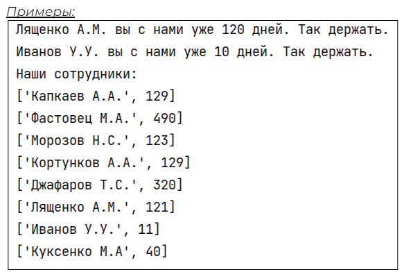

## [Задание 2.1 - Качество доставки](#task_1)
## [Задание 2.2 - Кто сейчас на работе](#task_2)
## [Задание 2.3 - Спасибо, что вы с нами](#task_3)
## [Задание 2.4 - Пора платить](#task_4)

#### [***Ссылка на тестирующую систему***](https://contest.yandex.ru/contest/43087/problems/) 
#### [_Ссылка на онлайн интерпретатор_](https://www.online-python.com/)
_________________________________________
_________________________________________

### Задание 1 - _Качество доставки_ <a name="task_1"></a>
Доработайте скрипт проверяющий стабильность качества доставки.

Качество доставки является стабильным если в наборе оценок нет оценок ниже **4**.   
Программа должна запрашивать ввод оценок через пробел и затем выносить вердикт о стабильности доставки.

Если доставка не качественна нужно вывести также процент качества.  
_Отношение суммы количества 4 и 5 к общему количеству оценок._

Если всё хорошо выведите - ```Доставка выполняется качественно```  
В ином случае - ```Текущее качество доставки - X%```  
На месте ```X``` должен быть результат расчёта

#### Прекод:
```python
# ввести числа строку с оценками
ratings =
# преобразовать все оценки в числа
print('Оценки за доставку в течении дня:', ratings)
stable = True
for i in range(len(ratings)):
   if ratings[i] < 4:
       stable = False
# проверить качество доставки
```

#### Пример программы:


_________________________________________
_________________________________________
### Задание 2 - _Кто сейчас на работе_<a name="task_2"></a>
Наши курьеры то появляются на складе, то уезжают выполнять доставку.
Для начал давайте сделаем удобный инструмент для вывода списка всех курьеров в красиво пронумерованном списке.

Программа при запуске:
1. выводит список курьеров в пронумерованном виде
2. запрашивает имена новых курьеров появившихся на смене (для разделителя между именами курьеров используйте знак ```#```)
3. печатает новый список курьеров

Печать списка должна быть оформлена в виде функции: ```get_free_couriers```

#### Прекод:
```python
def get_free_couriers(couriesrs: list):
   pass

couriers = ['Иванов В.А.', 'Капкаев А.А.', 'Джафаров Т.С.']
couriers.sort()
get_free_couriers(couriers)

# ваш код

get_free_couriers(couriers)

# ваш код
```

#### Пример программы:


_________________________________________
_________________________________________
### Задание 3 - _Спасибо, что вы с нами_<a name="task_3"></a>
В маркетплейс **Uzon** очень ценят сотрудников которые, работают с нами давно.

Очередной рабочий день подошёл к концу и нужно увеличить счётчики количества дней которые отработали наши курьеры.
У нас есть список с фамилиями курьеров которые были сегодня на смене (**_couriers_**) и список всех курьеров с количеством дней их работы (**_staff_**).

Программа должна пройти по списку сотрудников и если сотрудник сегодня работал увеличить его счётчик дней на 1. 
Если курьер отработал юбилейный день (**10**, **20**, **30** и т.д.) поздравьте его с этим.

Поздравление  
```<фио> вы с нами уже X дней. Так держать.```

Распечатайте список сотрудников.


#### Прекод:
```python
staff = [
   ['Капкаев А.А.', 129], ['Фастовец М.А.', 489],
   ['Морозов Н.С.', 122], ['Кортунков А.А.', 129],
   ['Джафаров Т.С.', 320], ['Лященко А.М.', 120],
   ['Иванов У.У.', 10], ['Куксенко М.А', 40]
]
couriers = [
   'Иванов У.У.', 'Фастовец М.А.',
   'Морозов Н.С.', 'Лященко А.М.'
]
# ваш код
```

#### Пример программы:

_________________________________________
_________________________________________
### Задание 4 - _Пора платить_<a name="task_4"></a>
В конце дня нужно обязательно подвести итоги и узнать сколько заработали курьеры.

Программа запрашивает ввод данных о курьере в формате ```Фамилия количество``` доставок через пробел.

_**Учтите что курьер может неверно ввести количество доставок.**_

Если наш курьер выполнил от **5** доставок до **10** его премия составит **20%** 
если же более **10** - **40%**.  
Когда сумма с премией будет посчитана не забудьте учесть налог в **13%**.

Итоговую выплату нужно сохранить вместе с данными о количестве доставок.  
Затем распечатать красивую таблицу, при помощи функции ```pretty_table_print``` (она уже готова).   
Вам нужно только собрать **_красивую_** структуру данных.

Посмотрите на код функции ```pretty_table_print```, там есть подсказки о необходимой структуре вашего списка.

#### Прекод:
```python
def pretty_table_print(data):
   print('-' * 70)
   print(f'|{"Фамилия":^38}|{"Доставки":^14}|{"Выплата":^14}|')
   print('-' * 70)
   for element in  data:
       print(f'|{element[0]:^38}|{element[1]:^14}|{element[2]:^14}|')
   print('-' * 70)


SALARY = 2000
# ваш код
```

#### Пример программы:
