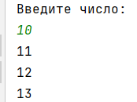
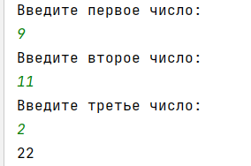
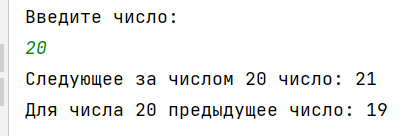
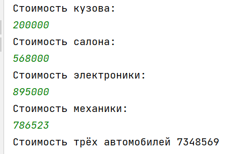

## [Задание 1.1 - Друг за другом](#task_1)
## [Задание 1.2 - Сумма трёх чисел](#task_2)
## [Задание 1.3 - До и после](#task_3)
## [Задание 1.4 - Три авто](#task_4)

#### [_Ссылка на онлайн интерпретатор_](https://www.online-python.com/)
_________________________________________
_________________________________________

### Задание 1 - _Друг за другом_ <a name="task_1"></a>
Напишите программу вывода на экран трех последовательно идущих чисел, каждое на отдельной строке. 

Первое число вводит пользователь, остальные числа вычисляются в программе.

#### Пример программы:

_________________________________________
_________________________________________
### Задание 2 - _Сумма трёх чисел_<a name="task_2"></a>
Напишите программу, которая считывает три целых числа и выводит на экран их сумму. 

Каждое число записано в отдельной строке.

#### Пример программы:

_________________________________________
_________________________________________
### Задание 3 - _До и после_<a name="task_3"></a>
Напишите программу, которая считывает целое число, 
после чего на экран выводится следующее и предыдущее целое число с **пояснительным** текстом.


**_Примеры текста_**:      
```Следующее за числом X число: X+1```     
```Для числа X предыдущее число: X-1```

_Вместо **X** должно быть ваше число._

#### Пример программы:

_________________________________________
_________________________________________
### Задание 4 - _Три авто_<a name="task_4"></a>
Напишите программу, которая считает стоимость **трех автомобилей**, состоящих из кузова, салона, электроники, механики.

**Формат входных данных:**    
На вход программе подаётся четыре целых числа, каждое на отдельной строке. 
- в первой строке — **стоимость кузова**
- во второй строке — **стоимость салона**
- в третьей строке — **стоимость электроники**
- в четвертой строке — **стоимость механики**.

**Формат выходных данных**     
Программа должна вывести одно число – стоимость покупки (трех автомобилей).


#### Пример программы:


_________________________________________
_________________________________________