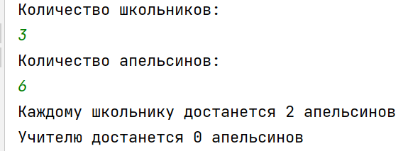

## [Задание 2.1 - Геометрия куба](#task_1)
## [Задание 2.2 - Мастер уравнений](#task_2)
## [Задание 2.3 - Таблица умножения](#task_3)
## [Задание 2.4 - Дайте апельсинов](#task_4)
## [Задание 2.5 - Метрические штуки](#task_5)
## [Задание 2.6 - Сколько времени?](#task_6)
## [Задание 2.7 - Сумма чисел в числе](#task_7)

#### [_Ссылка на онлайн интерпретатор_](https://www.online-python.com/)
_________________________________________
_________________________________________

### Задание 1 - _Геометрия куба_ 
Напишите программу, вычисляющую объём куба и площадь его полной поверхности, по введённому значению длины ребра.

**Формат входных данных**   
На вход программе подается **одно целое число** – _длина ребра_.

**Формат выходных данных**    
Программа должна вывести текст и числа в соответствии с условием задачи.

**Примечание**: Объём куба и площадь полной поверхности можно вычислить по формулам

#### Пример программы:

_________________________________________
_________________________________________
### Задание 2 - _Мастер уравнений_
Напишите программу вычисления значения функции по введённым целым значениям **a** и **b**.

**Формат входных данных**    
На вход программе подаётся два целых числа, каждое на отдельной строке. 
- в первой строке — значение **a**
- во второй строке — значение **b**.

**Формат выходных данных**   
Программа должна вывести значение функции по введённым числам **a** и **b**.

#### Пример программы:

_________________________________________
_________________________________________
### Задание 3 - _Таблица умножения_
Напишите программу, которая считывает целое положительное число **X** и выводит на экран последовательность чисел 

**x**, **2x**, **3x**, **4x** и **5x**, каждое на новой строке.

**Формат входных данных**     
На вход программе подаётся целое положительное число.
**Формат выходных данных**     
Программа должна вывести текст согласно условию задачи.

#### Пример программы:

_________________________________________
_________________________________________
### Задание 4 - _Дайте апельсинов_
**n** школьников делят **k** апельсинов поровну, неделящийся остаток остается учителю. 

Сколько целых апельсинов достанется каждому школьнику?    
Сколько целых апельсинов достанется учителю?

**Формат входных данных**     
На вход программе подаётся **_два целых числа_**: количество школьников и количество апельсинов, каждое на отдельной строке.

**Формат выходных данных**     
Программа должна вывести **два числа** на отдельных строках:     
- количество апельсинов, которое достанется каждому школьнику
- количество апельсинов, которое достанется учителю.

#### Пример программы:

_________________________________________
_________________________________________

### Задание 5 - _Метрические штуки_ 
Напишите программу, которая находит полное число **метров** по заданному числу **сантиметров**.

**Формат входных данных**      
На вход программе подаётся натуральное число – количество сантиметров.

**Формат выходных данных**      
Программа должна вывести одно число – полное число метров.

#### Пример программы:

_________________________________________
_________________________________________

### Задание 6 - _Сколько времени?_ 
Напишите программу для пересчёта величины временного интервала, заданного в минутах, в величину, выраженную в часах и минутах.

**Формат входных данных**      
На вход программе подаётся целое число – количество минут.

**Формат выходных данных**     
Программа должна вывести текст в соответствии с условием задачи.

#### Пример программы:

_________________________________________
_________________________________________

### Задание 7 - _Сумма чисел в числе_ 
Напишите программу для пересчёта величины временного интервала, заданного в минутах, в величину, выраженную в часах и минутах.

**Формат входных данных**      
На вход программе подаётся целое число – количество минут.

**Формат выходных данных**     
Программа должна вывести текст в соответствии с условием задачи.

#### Пример программы:

Напишите программу, в которой рассчитывается сумма и произведение цифр положительного **трёхзначного** числа.

**Формат входных данных**     
На вход программе подаётся положительное трёхзначное число.

**Формат выходных данных**     
Программа должна вывести два числа с поясняющим текстом: сумма цифр и произведение цифр.

_________________________________________
_________________________________________