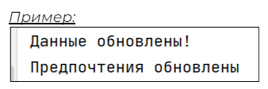
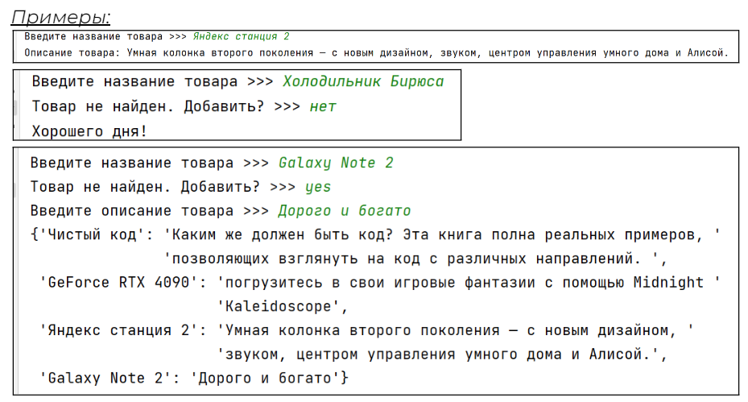
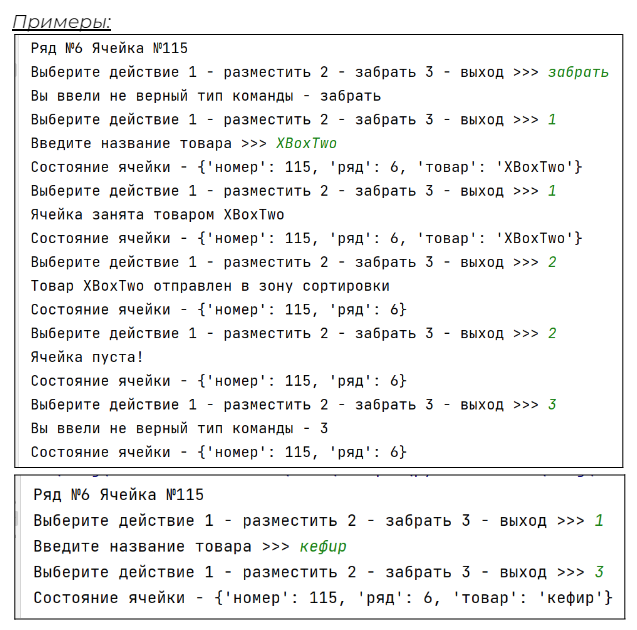
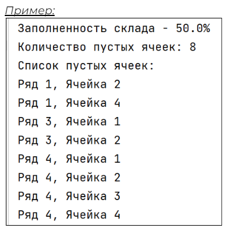

## [Задание 1.1 - Удаляй и добавляй](#task_1)
## [Задание 1.2 - База данных товаров](#task_2)
## [Задание 1.3 - Работай робот работай](#task_3)
## [Задание 1.4 - Сколько у нас свободных ячеек](#task_4)

#### [***Ссылка на тестирующую систему***]() 
#### [_Ссылка на онлайн интерпретатор_](https://www.online-python.com/)
_________________________________________
_________________________________________

### Задание 1 - _Удаляй и добавляй_ <a name="task_1"></a>
Для начал давайте немного поработаем с наборами данных в качестве эксперимента.

У нас есть небольшой набор данных о самых популярных товарах в категории. Внесите туда изменения:
1. Добавьте новые пары категория - товар ```кофе в зёрнах``` - ```Bushido``` и ```смартфон``` - ```Apple```
2. Удалите категорию ```кофе растворимый```


#### Прекод:
```python
popular_products = {
   'электроника': 'RTX 4090',
   'книга': 'Гарри Поттер',
   'кофе растворимый': 'Jacobs',
   'холодильник': 'Bosh'
}

# добавляй и удаляй

if 'смартфон' in popular_products and 'кофе в зёрнах' in popular_products:
    print('Данные обновлены!')
if 'кофе растворимый' not in popular_products:
    print('Предпочтения обновлены')
```

#### Пример программы:
> 
_________________________________________
_________________________________________
### Задание 2 - _База данных товаров_<a name="task_2"></a>
Реализуйте функционал для базы данных товаров. Нам нужен адаптивный скрипт для поиска информации о товаре и добавления новых товаров.

Программа запрашивает название товара.

1. Если товар есть в базе данных, скрипт должен выводить ```Описание товара:``` и само **описание**

2. Если товара нет, то скрипт выводит: ```Товар не найден. Добавить?```. 
   - Если пользователь отвечает ```Да``` или `yes` ил `y` то запрашивается ввод описания товара. Затем товар и его описание добавляются в базу данных. 
После этого необходимо вывести на экран всю базу данных.
   - Если пользователь не хочет добавлять товар, то скрипт выводит: ```Хорошего дня!``` и завершает работу.


#### Прекод:
```python
products = {
    'Чистый код': 'Каким же должен быть код? Эта книга полна реальных примеров, позволяющих взглянуть на код с '
                  'различных направлений. ',
    'GeForce RTX 4090': 'погрузитесь в свои игровые фантазии с помощью Midnight Kaleidoscope',
    'Яндекс станция 2': 'Умная колонка второго поколения — с новым дизайном, звуком, центром управления умного дома и '
                        'Алисой.'
}

# ваш код
```

#### Пример программы:
> 
_________________________________________
_________________________________________
### Задание 3 - _Работай робот работай_<a name="task_3"></a>
На складе появился специальный робот который может размещать товары в отсеках склад и забирать их оттуда. Робот работает с базой данных склада и знает в какой ячейке, что лежит.
Кладовщик теперь может пить кофе и работать с компьютера, точнее сможет когда мы напишем несколько скриптов.

В начале наш скрипт отображает приветствие: ```Ряд №X Ячейка №Y```

Затем выбор действия: `1 - разместить` `2 - забрать` `3 - выход`

**_Описание работы действий:_**
1. При выборе действия скрипт запрашивает ввод названия товара, и создаёт новую пару ключ - значение в словаре **товар** - **название**. Учтите, что полка может быть занята. В таком случае нужно вывести ```Ячейка занята товаром X```
**X** - название товара.
2. При выборе действия **забрать** пара ключ-значение **товар** - **название** должна удаляться из словаря. На экране должно появляться сообщение `Товар X отправлен в зону сортировки`. Если полка пуста, выведите `Ячейка пуста!` **X** - название товара.
3. При выходе просто выведите строку ```Состояние ячейки - X```  **X** - весь словарь ячейки.
4. Если пользователь ввёл несуществующую команду выведите ```Вы ввели неверный тип команды - Y``` **Y** - введённая команда

**_Примечание:_** Строка состояние ячейки должна выводиться после каждой операции **_кроме неверной_**.


**Строки для ввода:**   
```Выберите действие 1 - разместить 2 - забрать 3 - выход >>> ```   
```Введите название товара >>> ```   
```Ячейка занята товаром X```    
```Товар X отправлен в зону сортировки```   
```Ячейка пуста!```   
```Состояние ячейки - X```    
```Вы ввели неверный тип команды - Y```


#### Прекод:
```python
cell = {'номер': 115, 'ряд': 6}
actions = tuple('123')

# ваш код
```


#### Пример программы:
> 
_________________________________________
_________________________________________
### Задание 4 - _Сколько у нас свободных ячеек_<a name="task_4"></a>
Теперь нам нужен скрипт который будет определять загруженность склада по количеству уже занятых ячеек и собирать список пустых ячеек на складе.

Наш скрипт должен проверить базу данных со всеми ячейками и указать количество пустых ячеек, процент загруженности склада и вывести список всех доступных ячеек.

Ячейка считается занятой если её значение равно ```used``` и пустой если её значение ```empty```

Загруженность склада, в процентах, можно определить как `количество занятых ячеек` / `общее количество ячеек` * `100`

Все пустые ячейки нужно собрать в список каждым элементом которого является кортеж вида ```(ряд, ячейка)``` и вывести на экран.

**Строки для ввода:**   
```Заполненность склада - X%```   
```Количество пустых ячеек: X```   
```Список пустых ячеек:```


#### Прекод:
```python
warehouse = {
    'Ряд 1': {1: 'used', 2: 'empty', 3: 'used', 4: 'empty'},
    'Ряд 2': {1: 'used', 2: 'used', 3: 'used', 4: 'used'},
    'Ряд 3': {1: 'empty', 2: 'empty', 3: 'used', 4: 'used'},
    'Ряд 4': {1: 'empty', 2: 'empty', 3: 'empty', 4: 'empty'},
}
empty_cells = []
   # ваш код
```

#### Пример программы:
> 

_________________________________________
_________________________________________
