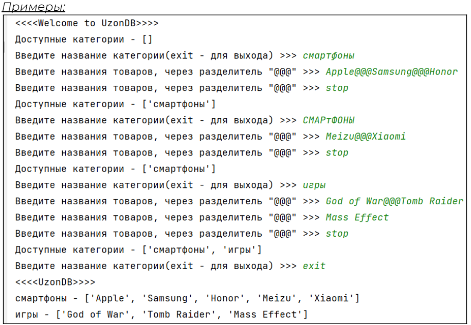
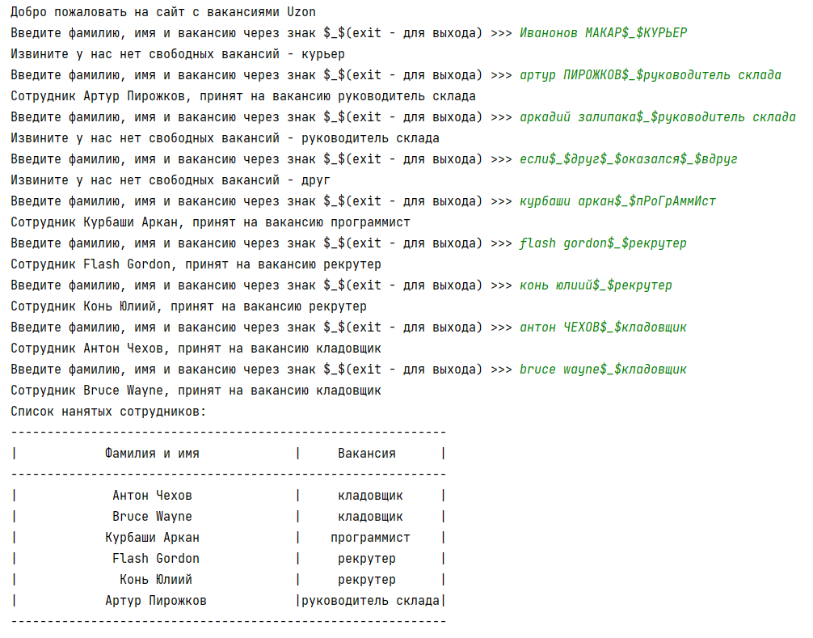
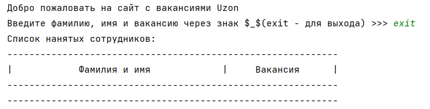
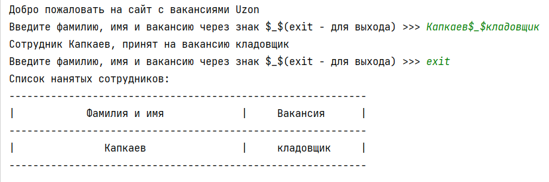

## [Задание 2.1 - Наполняем базу данных](#task_1)
## [Задание 2.2 - Отдел кадров](#task_2)

#### [***Ссылка на тестирующую систему***]() 
#### [_Ссылка на онлайн интерпретатор_](https://www.online-python.com/)
_________________________________________
_________________________________________

### Задание 1 - _Наполняем базу данных_ <a name="task_1"></a>
Пора создать скрипт для наполнения базы данных товаров.

Наш скрипт должен запрашивать введение названия категории и затем список товаров. 
При этом мы должны иметь возможность дополнять наши категории если они уже существуют.
Для этого используйте метод списка ```extend```.

**Последовательность работы:**

Для начала выведите на экран приветствие ```<<<<Welcome to UzonDB>>>>```    
1. скрипт отображает доступные категории для заполнения и запрашивает ввод категории (для выхода нужно ввести `exit`) 
2. скрипт запрашивает ввод товаров одной строкой с разделителем ```@@@``` может запрашивать несколько раз 
(для выхода нужно ввести `stop`) 
После выхода необходим отобразить список категорий со списком всех товаров как это показано на картинке.

**_Примечание:_** категории должны быть записаны в нижнем регистре независимо от ввода пользователя, 
товары в категориях пока что могут повторяться.

   
**Строки для ввода и вывода:**   
```<<<<Welcome to UzonDB>>>>```   
```Доступные категории - ```   
```Введите название категории(exit - для выхода) >>> ```     
```Введите названия товаров, через разделитель "@@@" >>> ```

#### Прекод:
```python
category_products = {}
```

#### Пример программы:
> 

_________________________________________
_________________________________________
### Задание 2 - _Отдел кадров_<a name="task_2"></a>
Фух со складом разобрались. Пора помогать отделу кадров.

В отделе кадров есть несколько вакансий и они должны быть синхронизированы с нашей базой данных.

Нам нужен скрипт который обрабатывает заявки от работников на конкретную вакансию, скрипт работает пока не будет введено слово exit или не закончатся вакансии.

**Порядок работы:**   
1. Скрипт приветствует вас ```Добро пожаловать на сайт с вакансиями Uzon```
2. Скрипт просит ввести вас Фамилию и Имя нового работника, а также вакансию которая его интересует через разделитель `$_$`
   1. Если такая вакансия не существует или нет мест нужно вывести ```Извините у нас нет свободных вакансий - X``` **X** - название введённой вакансии.
   2. Если вакансия есть, то добавить нашего кандидата вместе с вакансией в список
   3. Если вместо фамилии и имени было введено `exit` закончить ввод
   4. Если количество вакансий равно нулю закончить ввод.
3. Распечатать список всех нанятых сотрудников используя функцию `print_pretty_table`

**_Примечание:_** позаботьтесь о регистре ввода вакансии и данных кандидата, все имена и фамилии должны начинаться с большой буквы в нашей базе данных, используйте
метод строки `title`

#### Прекод:
```python
def pretty_table_print(data):
    print('-' * 60)
    print(f'|{"Фамилия и имя":^38}|{"Вакансия":^19}|')
    print('-' * 60)
    data.sort(key=lambda x: x[1])
    for element in data:
        print(f'|{element[0]:^38}|{element[1]:^19}|')
    print('-' * 60)


separator = '$_$'
greeting_text = 'Добро пожаловать на сайт с вакансиями Uzon'
input_text = f'Введите фамилию, имя и вакансию через знак {separator}(exit - для выхода) >>> '

vacancies = {
    'программист': 1,
    'кладовщик': 2,
    'руководитель склада': 1,
    'рекрутер': 2
}

# ваш код
```

#### Примеры программы:
> 
> 
> 
_________________________________________
_________________________________________