## [Задание 2.1 - Арифметическая прогрессия](#task_1)
## [Задание 2.2 - Наименьшее число](#task_2)
## [Задание 2.3 - Наименьшее из чисел pro](#task_3)
## [Задание 2.4 - На сколько ты стар](#task_4)
## [Задание 2.5 - В диапазоне](#task_5)
## [Задание 2.6 - В диапазоне pro](#task_6)
## [Задание 2.7 - Високосный год](#task_7)


#### [_Ссылка на онлайн интерпретатор_](https://www.online-python.com/)
_________________________________________
_________________________________________

### Задание 1 - _Арифметическая прогрессия_ <a name="task_1"></a>
Напишите программу, которая определяет, являются ли три заданных числа (в указанном порядке) последовательными членами арифметической прогрессии.

**Формат входных данных**  
На вход программе подаются три числа, каждое на отдельной строке.

**Формат выходных данных**  
Программа должна вывести ```YES``` или ```NO``` (без кавычек) в соответствии с условием задачи. 


#### Пример программы:
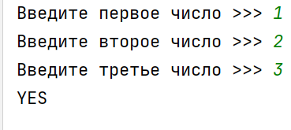

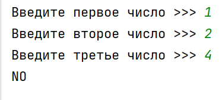
_________________________________________
_________________________________________
### Задание 2 - _Наименьшее число_<a name="task_2"></a>
Напишите программу, которая определяет наименьшее из двух чисел.

**Формат входных данных**  
На вход программе подаётся два различных целых числа.

**Формат выходных данных**  
Программа должна вывести наименьшее из двух чисел.


#### Пример программы:
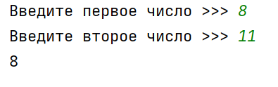
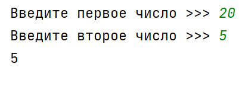
_________________________________________
_________________________________________
### Задание 3 - _Наименьшее из чисел pro_<a name="task_3"></a>
Напишите программу, которая определяет наименьшее из четырёх чисел


**Формат входных данных**  
На вход программе подаётся четыре целых числа.

**Формат выходных данных**  
Программа должна вывести наименьшее из четырёх чисел.

#### Пример программы:
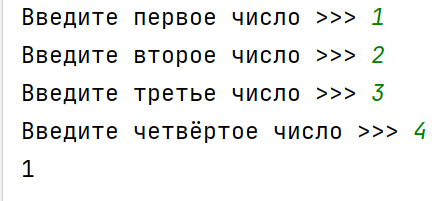
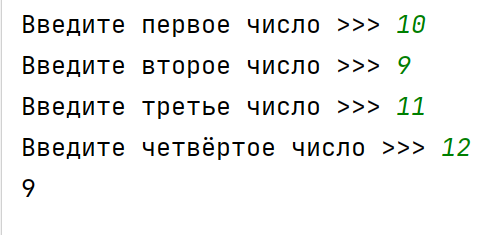
_________________________________________
_________________________________________
### Задание 4 - _На сколько ты стар_<a name="task_4"></a>
Напишите программу, которая по введённому возрасту пользователя сообщает, к какой возрастной группе он относится:
- до **13** включительно – ```детство```;
- от **14 до 24** – `молодость`;
- от **25 до 59** – `зрелость`;
- от **60** – `старость`.


**Формат входных данных**  
На вход программе подаётся одно целое число – возраст пользователя.

**Формат выходных данных**  
Программа должна вывести название возрастной группы.

#### Пример программы:
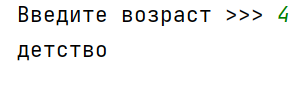
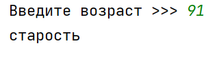

_________________________________________
_________________________________________

### Задание 5 - _В диапазоне_ <a name="task_5"></a>
Проверьте принадлежит ли число введенное с клавиатуры промежутку от **1** до **10** 


**Формат входных данных**  
На вход программе подается целое число **X**

**Формат выходных данных**  
Программа должна вывести текст в соответствии с условием задачи

**_Примеры текста вывода_**:      
```принадлежит```     
```не принадлежит```


#### Пример программы:
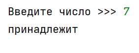
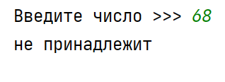

_________________________________________
_________________________________________

### Задание 6 - _В диапазоне pro_ <a name="task_6"></a>
Проверьте принадлежит ли число введенное с клавиатуры промежутку от -10 до -5 или промежутку от 5 до 15

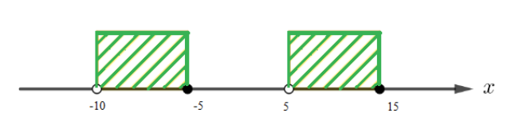


**Формат входных данных**  
На вход программе подается целое число **X**

**Формат выходных данных**  
Программа должна вывести текст в соответствии с условием задачи.

**_Примеры текста вывода_**:      
```принадлежит```     
```не принадлежит```

#### Пример программы:
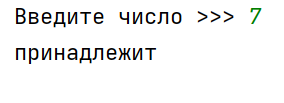
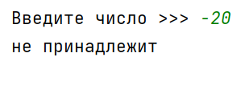

_________________________________________
_________________________________________

### Задание 7 - _Високосный год_ <a name="task_7"></a>
Напишите программу, которая определяет, является ли год с данным номером високосным. 

Если год является високосным, то выведите `YES`, иначе выведите `NO`.

Год является високосным, если его номер кратен **4**, но не кратен **100**, или если он кратен **400**.


**Формат входных данных**  
На вход программе подаётся целое число – количество минут.

**Формат выходных данных**  
Программа должна вывести текст в соответствии с условием задачи.

#### Пример программы:

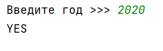
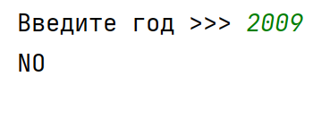

_________________________________________
_________________________________________