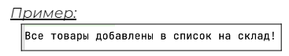
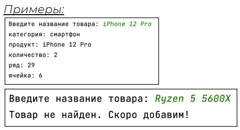
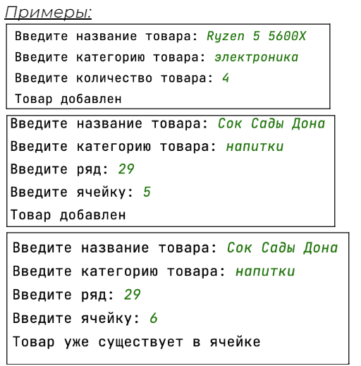

## [Задание 1.1 - Все больше и больше](#task_1)
## [Задание 1.2 - Покажи мне, что у тебя есть](#task_2)
## [Задание 1.3 - Добавь побольше](#task_3)

#### [_Ссылка на онлайн интерпретатор_](https://www.online-python.com/)
_________________________________________
_________________________________________

### Задание 1 - _Все больше и больше_ <a name="task_1"></a>
Поскольку товаров на склад стало поступать все больше и больше, 
заказчики Uzon задумались над тем, что им может не хватит вычислительных ресурсов на все имеющиеся 
и будущие товары, поэтому стали сокращать хранимую информацию.  

Перед вами часть популярных товаров в новом хранимом формате данных. Внесите туда изменения:


Добавьте новые товары:  
**молочный улун** категории **чай** и **заварник** категории **чайные приборы** в любом количестве, 
в любой ряд и любую ячейку. 

_**Примечание:**_  
каждое новое значение должно соответствовать индексу порядка, 
как в первом элементе списка  
(`категория` - **0**, `продукт` - **1** , `количество` - **2**, …)

#### Прекод:
```python
# категория, наименование, количество, ряд, ячейка

popular_products = [
   ['электроника', 'Ryzen 5 5900X', 10, 15, 1],
   ['электроника', 'Ryzen 5 5600X', 4, 15, 2],
   ['смартфон', 'iPhone 12 Pro', 2, 29, 6],
   ['бытовая техника', 'Фен PHILIPS', 1, 5, 12],
]

# Все больше и больше

positive = 0

for product in popular_products:
   if product[0] == "чай" and product[1] == "молочный улун":
       print("Добавлен в список на склад!")
       positive += 1
   elif product[0] == "чайные приборы" and product[1] == "заварник":
       print("Добавлен в список на склад!")
       positive += 1

if positive == 2:
   print("Все товары добавлены в список на склад!")
```

#### Пример программы:
> 
_________________________________________
_________________________________________
### Задание 2 - _База данных товаров_<a name="task_2"></a>
Реализуйте вывод всех товаров, которые есть в наличие на складе. 
Для этого необходимо воспользоваться циклом **for**, чтобы верно перебрать массив.  
Затем сделайте запрос в список среза поиска товаров в наличии с товаром. 

1. Если товар есть в наличии, выведите о нем всю информацию. Воспользуйтесь заголовками к описанию каждого элемента товара для вывода. 

2. Если товара нет, то скрипт выводит: `Товар не найден. Скоро добавим!`


#### Прекод:
```python
# категория, наименование, количество, ряд, ячейка

popular_products = [
   ['категория', 'продукт', 'количество', 'ряд', 'ячейка'],
   ['электроника', 'Ryzen 5 5900X', 0, 15, 1],
   ['электроника', 'Ryzen 5 5600X', 0, 15, 2],
   ['смартфон', 'iPhone 12 Pro', 2, 29, 6],
   ['бытовая техника', 'Фен PHILIPS', 1, 5, 12],
   ['чай', 'молочный улун', 30, 9, 3],
]


# вывод товара в удобном виде
def pretty_print(product):
   columns = popular_products[0]
   for i in range(len(columns)):
       print(columns[i] + ':', product[i])


# поиск товара из списка по наличию
def search_product(product_name):
   # ваш код


product_name = input("Введите название товара: ")
search_product(product_name)

```

#### Пример программы:
> 
_________________________________________
_________________________________________
### Задание 3 - _Работай робот работай_<a name="task_3"></a>
Помните робота, который появился на складе? 
Он же может добавлять товары на склад из только что приехавшего грузовика!  
Ваша задача – добавить товар на склад. 


1. Если товар уже есть в базе, то увеличьте количество этого товара на произвольное

2. Если товара нет в базе, то дополнительно укажите ряд и ячейку

3. Если в указанной ячейке уже есть товар, выведите `Ячейка занята`


**_Примечание:_** в функции **_add_product_** могут присутствовать не обязательные к указанию аргументы `row` и `cell`. 


#### Прекод:
```python
popular_products = [
   ['категория', 'продукт', 'количество', 'ряд', 'ячейка'],
   ['электроника', 'Ryzen 5 5900X', 0, 15, 1],
   ['электроника', 'Ryzen 5 5600X', 0, 15, 2],
   ['смартфон', 'iPhone 12 Pro', 2, 29, 6],
   ['бытовая техника', 'Фен PHILIPS', 1, 5, 12],
   ['чай', 'молочный улун', 30, 9, 3]
]


# добавление товара в список
def add_product(product_name, category, quantity, row=None,cell=None):
   # ваш код


product_name = input("Введите название товара: ")
category = input("Введите категорию товара: ")
quantity = int(input("Введите количество товара: "))
row = int(input("Введите ряд: "))
cell = int(input("Введите ячейку: "))

add_product(product_name, category, quantity, row, cell)
```


#### Пример программы:
> 

_________________________________________
_________________________________________

