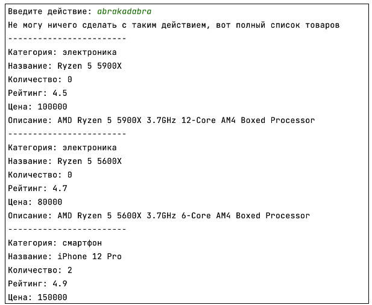

## [Задание 2.1 - Снова сортируем, но по качеству](#task_1)
## [Задание 2.2 - Такие похожие, но такие разные](#task_2)

#### [_Ссылка на онлайн интерпретатор_](https://www.online-python.com/)
_________________________________________
_________________________________________

### Задание 1 - _Снова сортируем, но по качеству_ <a name="task_1"></a>
Попробуем поработать с чем-то более сложно структурированным.  
Теперь у нас есть база данных в виде словаря с вложенными словарями и списками. 
Наша задача – показать клиенту **товары** в зависимости от выбранных **фильтров**, 
и отсортировать их по фильтру. 

Наш скрипт должен запрашивать введение названия категории и затем список товаров. 
При этом мы должны иметь возможность дополнять наши категории если они уже существуют.
Для этого используйте метод списка ```extend```.

**Последовательность работы:**

Подгрузим базу данных.  
Для этого можем воспользоваться отдельным файлом, который назовем `uzon_db.py`  
(**_Примечание:_** файл можно передать любым удобным способом, главное, чтобы он был у каждого ученика на ноутбуке в той же папке, что и файл скрипта для задания) 
 
1. Написать и применить две функции для сортировки(функции `sort_by_price`, `sort_by_rating`)
2. Пользователь может указать одно из двух правил: `price`, `rating` Если указанного действия нет в этом списке, вывести **все товары** из базы данных
3. Распечатать список товаров с помощью функции `pretty_print`

Задача написать 2 функции сортировки товара с помощью метода `.sort()`.  
Для сортировки потребуется знать, как можно использовать `lambda`-**функцию**, а также как произвести обратную сортировку через аргумент `reverse`

#### Прекод:
```python
from uzon_db import database


def pretty_print(item):
    print('------------------------')
    print(f"Категория: {item['category']}")
    print(f"Название: {item['name']}")
    print(f"Количество: {item['quantity']}")
    print(f"Рейтинг: {item['info']['rating']}")
    print(f"Цена: {item['info']['price']}")
    print(f"Описание: {item['info']['description']}")


def sort_by_price():
    # Ваш код


def sort_by_rating():
    # Ваш код
   

action = input('Введите действие: ')
if action == 'price':
    print('Сортировка по цене')
    sort_by_price()
elif action == 'rating':
    print('Сортировка по рейтингу (от большего к меньшему)')
    sort_by_rating()
else:
    print('Не могу ничего сделать с таким действием, вот полный список товаров')
    
for item in database['items']:
    pretty_print(item)
```

#### Пример программы:
> 
> 
> 
> 

_________________________________________
_________________________________________
### Задание 2 - _Такие похожие, но такие разные_<a name="task_2"></a>
Отлично! Наконец-то наши клиенты смогут быстрее находить интересующие их товары. 
Но товары в разных категориях бывают разными, со своими особенностями. 
Поэтому заказчики из Uzon просят нас помочь добавить в поиск еще небольшую деталь – 
различать характеристики товара.  
К сожалению, они не успели отметить все характеристики на товары в базе данных, 
поэтому мы попробуем сами обрабатывать товары без указанных характеристик и с указанными 
характеристиками.

Файл с базой данных остается прежним.

**Порядок работы:**   
1. Скрипт просит вас ввести характеристику товара и значение, выше которого нужно найти товар
2. Скрипт производит фильтрацию товаров в базе, ищет наличие ключа `characteristics` для каждого товара, а затем ищет наличие запрашиваемого ключа. После сравнивает значение ключа с указанными нами (`item.y >= our_x`)
   1. Если нет ни одного товара с полем **characteristics** или с запрашиваемым ключём характеристики, скрипт должен вывести “`Нет товаров с такой характеристикой`”  
   2. Если нет ни одного товара, удовлетворяющего условию, вывести “`Товаров с такими характеристиками нет`”
3. Распечатать список товаров, удовлетворяющему условию фильтрации с помощью функции `pretty_print`

**_Примечание:_** для качественной работы обеспечьте помощь с объяснением и отладкой работы метода **.get()** для словарей.

#### Прекод:
```python
from uzon_db import database


def pretty_print(item, characteristic):
    print('------------------------')
    print(f"Категория: {item['category']}")
    print(f"Название: {item['name']}")
    print(f"Рейтинг: {item['info']['rating']}")
    print(f"{characteristic}: {item['characteristics'][characteristic]}")


def show_by_key(key, value):
    # Ваш код

key = input('Введите характеристику: ')
value = float(input('Введите значение (y товара >= x): '))

print(f'Товары с характеристикой "{key}" >= {value}')
show_by_key(key, value)
```

#### Примеры программы:
> 
> 
> 
> 
> 
_________________________________________
_________________________________________
