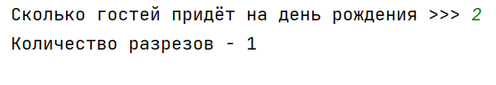
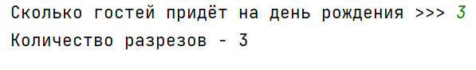
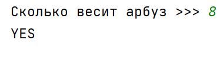
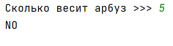
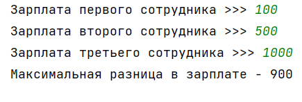

## [Задание 1.1 - Пора есть торт](#task_1)
## [Задание 1.2 - Правильный арбуз](#task_2)
## [Задание 1.3 - Денежное неравенство](#task_3)

#### [_Ссылка на онлайн интерпретатор_](https://www.online-python.com/)
_________________________________________
_________________________________________

### Задание 1 - _Пора есть торт_ 
На свой день рождения Петя купил красивый и вкусный торт, который имел идеально круглую форму. 
Петя не знал, сколько гостей придет на его день рождения, поэтому вынужден был разработать алгоритм, 
согласно которому он сможет быстро разрезать торт на **N** равных частей.  
Следует учесть, что разрезы торта можно производить как по радиусу, так и по диаметру.
 
Помогите Пете решить эту задачу, определив наименьшее число разрезов торта по заданному числу гостей.

**Формат входных данных:**  
На вход программе подаются число гостей считая самого Петю

**Формат выходных данных:**  
Программа должна вывести одну строку в соответствии с условием задачи.

#### Примеры программы:
> 
> 

_________________________________________
_________________________________________
### Задание 2 - _Правильный арбуз_
В один из жарких летних дней Петя и его друг Вася решили купить арбуз.  
Они выбрали самый большой и самый спелый, на их взгляд. После недолгой процедуры взвешивания весы показали **W** килограмм. 
Поспешно прибежав домой, изнемогая от жажды, ребята начали делить приобретенную ягоду, однако перед ними встала нелегкая задача. 
Петя и Вася являются большими поклонниками четных чисел, поэтому хотят поделить арбуз так, чтобы доля каждого весила именно четное число килограмм, при этом не обязательно, чтобы доли были равными по величине.
Ребята очень сильно устали и хотят скорее приступить к трапезе, поэтому Вы должны подсказать им, удастся ли поделить арбуз, учитывая их пожелание. 

Разумеется, каждому должен достаться кусок положительного веса.

**Формат входных данных**  
На вход программе одно целое число - вес арбуза 

**Формат выходных данных**  
Программа должна выводить сообщение о том смогут ли ребята поделить 
арбуз на две части каждая из которых будет четным числом килограмм  

#### Примеры программы:
> 
> 
_________________________________________
_________________________________________
### Задание 3 - _Денежное неравенство_
В отделе работают 3 сотрудника, которые получают заработную плату в рублях. 

Требуется определить: на сколько зарплата самого высокооплачиваемого из них отличается от самого низкооплачиваемого.

**Формат входных данных:**  
на вход программе подаются три числа, 
каждое из которых является положительным числам обозначающим размер зарплаты сотрудника

**Формат выходных данных:**  
Программа должна вывести единственное число согласно условию задачи.

#### Пример программы:
> 

_________________________________________
_________________________________________
