## [Задание 2.1 - Флеш против Зума](#task_1)
## [Задание 2.2 - Triangle Type](#task_2)
## [Задание 2.3 - Медиана](#task_3)
## [Задание 2.4 - Сколько дней в месяце](#task_4)
## [Задание 2.5 - Контрольное взвешивание](#task_5)
## [Задание 2.6 - Мини калькулятор](#task_6)
## [Задание 2.7 - What a number](#task_7)


#### [_Ссылка на онлайн интерпретатор_](https://www.online-python.com/)
_________________________________________
_________________________________________

### Задание 1 - _Флеш против Зума_ <a name="task_1"></a>
Зум бросил вызов Флэшу и предложил ему честный поединок в виде гонки вокруг магнетара. 

В случае проигрыша эта нейтронная звезда зарядится и уничтожит мир, 
поэтому Флэш решил не рисковать без причины, и узнать у своего друга Циско Рамона есть ли смысл 
принимать вызов.  
Циско получил данные, что скорость Зума равна **n**, а скорость Флэша равна **k**.
Напишите программу, которая должна вывести ответ Циско на вопрос Флэша.


**Формат входных данных**  
На вход программе подаётся два целых числа **n** и **k** 

**Формат выходных данных**  
Если Зум быстрее Флэша нужно вывести `NO`  
если Флэш быстрее Зума нужно вывести `YES`  
если их скорости равны нужно вывести `Don't know`. 


#### Примеры программы:
> 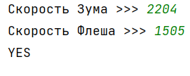
> 
> 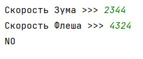
_________________________________________
_________________________________________
### Задание 2 - _Triangle Type_<a name="task_2"></a>
Напишите программу, которая принимает три положительных числа и определяет вид треугольника. 
Длины сторон которого равны введенным числам.


**Формат входных данных**  
На вход программе подаются три числа – длины сторон существующего треугольника.

**Формат выходных данных**  
Программа должна вывести на экран текст – вид треугольника  
(`Равносторонний`, `Равнобедренный` или `Разносторонний`).


#### Пример программы:
>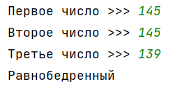
>
>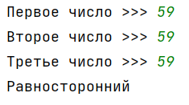
>
>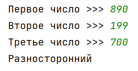
_________________________________________
_________________________________________
### Задание 3 - _Медиана_<a name="task_3"></a>
Даны три различных целых числа. 

Напишите программу, которая находит среднее по величине число.


**Формат входных данных**  
На вход программе подаётся три различных целых числа, каждое на отдельной строке.

**Формат выходных данных**  
Программа должна вывести среднее число.

#### Пример программы:
> 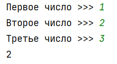
>
>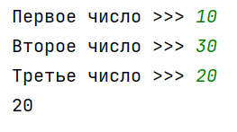
_________________________________________
_________________________________________
### Задание 4 - _Сколько дней в месяце_<a name="task_4"></a>
 Дан порядковый номер месяца **(1,2,…, 12)**.  
 Напишите программу, которая выводит на экран количество дней в этом месяце. 
 Принять, что год является невисокосным.

**_Примечание._** Постарайтесь написать программу, так чтобы в ней было не более _трех_ условий.

**Формат входных данных**  
На вход программе подаётся одно целое число – порядковый номер месяца.

**Формат выходных данных**  
Программа должна вывести количество дней в этом месяце.

#### Пример программы:
>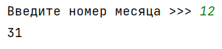
> 
>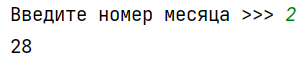

_________________________________________
_________________________________________

### Задание 5 - _Контрольное взвешивание_ <a name="task_5"></a>
Известен вес боксера-любителя (_целое число_).  
Известно, что вес таков, что боксер может быть отнесен к одной из трех весовых категорий:

`Легкий вес` – до **60** кг;  
`Первый полусредний вес` – до **64** кг;  
`Полусредний вес` – до **69** кг.  

Напишите программу, определяющую, в какой категории будет выступать данный боксер. 

**Формат входных данных**  
На вход программе подаётся одно целое число.

**Формат выходных данных**  
Программа должна вывести текст – название весовой категории.


#### Пример программы:
>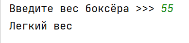
> 
>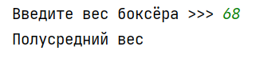

_________________________________________
_________________________________________

### Задание 6 - _Мини калькулятор_ <a name="task_6"></a>
Напишите программу, которая считывает с клавиатуры два целых числа и строку. 
Если эта строка является обозначением одной из четырех математических операций (`+, -, *, /`), 
то выведите результат применения этой операции к введенным ранее числам, 
в противном случае выведите  
```Неверная операция```. 

Если пользователь захочет поделить на ноль, выведите текст ```На ноль делить нельзя!```.


**Формат входных данных**  
На вход программе подаются **два целых числа**, каждое на отдельной строке, и **строка**.

**Формат выходных данных**  
Программа должна вывести результат применения операции к введенным числам или соответствующий текст, 
если операция неверная либо если происходит деление на ноль.


#### Пример программы:
>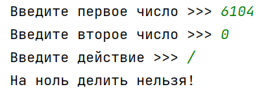
> 
>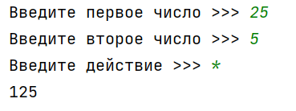
> 
>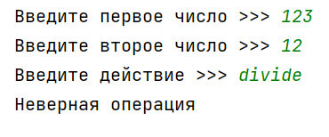

_________________________________________
_________________________________________

### Задание 7 - _What a number_ <a name="task_7"></a>
Напишите программу, которая принимает на вход число и в зависимости от условий выводит текст 
`YES`, либо `NO`.

**_Условия:_**

- если число нечетное, то вывести `YES`;
- если число чётное в диапазоне от **2** до **5** (включительно), то вывести `NO`;
- если число чётное в диапазоне от **6** до **20** (включительно), то вывести `YES`;
- если число четное и больше **20**, то вывести `NO`.


**Формат входных данных**  
На вход программе подается натуральное число.

**Формат выходных данных**  
Программа должна вывести текст в соответствии с условием задачи.

#### Пример программы:

>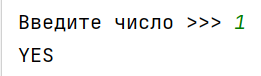
> 
>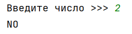

_________________________________________
_________________________________________