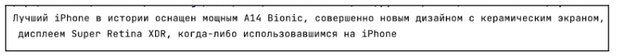
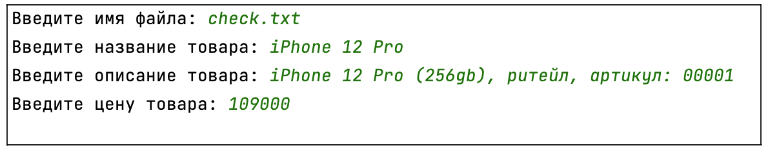
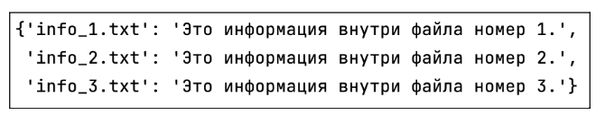
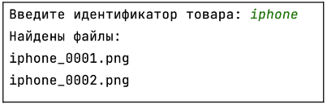

## [Задание 1.1 - Посмотрим описание товара](#task_1)
## [Задание 1.2 - Распечатать чек?](#task_2)
## [Задание 1.3 - Посмотрим, что тут хранится](#task_3)
## [Задание 1.4 - Макеты товаров](#task_4)

#### [_Ссылка на онлайн интерпретатор_](https://www.online-python.com/)
_________________________________________
_________________________________________

### Задание 1 - _Посмотрим описание товара_ <a name="task_1"></a>
Прежде чем описать товар, продуктовые менеджеры просят редакторов записать все в виде сырого 
текста в файле.  
Ваша задача - прочитать текст из файла **description.txt** и вывести его на экран:


_**Примечание:**_  
на диске в папке хранится файл **description.txt**, 
перед выполнением задания убедитесь, что файл находится на компьютерах учеников 
в той же директории, что и скрипт.


#### Прекод:
```python
# имя файла
filename = 'description.txt'

# открываем файл в режиме чтения
# ваш код

# выводим информацию на экран
print(desc)
```

#### Пример программы:
> 
_________________________________________
_________________________________________
### Задание 2 - _Распечатать чек?_<a name="task_2"></a>
Реализуйте запись информации о товаре, его стоимости в файл (_укажите имя файла_).  
Если файл не был создан вами вручную, для этого существует дополнительный режим **w+**, 
который вначале создает указанный файл в директории, а затем производит операцию записи информации 
в только что созданный файл.  
В случае использования режима **w**, программа вернет ошибку, поскольку не сможет найти существующий файл 
(_если такой не был создан вами изначально_)


#### Прекод:
```python
# вводим имя файла
filename = input('Введите имя файла: ')

# вводим имя товара
name = input('Введите название товара: ')

# вводим описание товара
description = input('Введите описание товара: ')

# вводим цену товара
price = input('Введите цену товара: ')

# открываем файл в режиме записи (создаем новый файл в режиме w+)
# ваш код
```

#### Пример программы:
> 
_________________________________________
_________________________________________
### Задание 3 - _Посмотрим, что тут хранится_<a name="task_3"></a>
Помните, мы говорили про хранение базы в виде словарей? 
Как оказалось, есть еще много описаний товара, не опубликованных редакторами, 
и они не помнят, как точно назывались файлы. 
Однако все файлы имеют расширение **.txt**. Напишите скрипт, который:

1. Просматривает все файлы в текущей директории

2. Если файл имеет расширение **.txt**, то в словарь `content` заносится информация, 
где **ключ** – имя файла, **значение** – информация внутри файла

3. Выводит словарь на экран (любым образом)


**_Примечание:_** создайте 3-4 разных файла с расширением **.txt** в той же директории, в которой находится скрипт. 


#### Прекод:
```python
import os
from pprint import pprint

# Получение списка имен файлов
filenames = ...# Ваш код

# Объявление переменной для хранения файлов
content = {}

# Циклический перебор имен файлов
for filename in filenames:
   # Вывод имен файлов с расширением .txt
   if filename.endswith('.txt'): ...
       # Открытие файла
       # Чтение содержимого файла
       # Ваш код

# Вывод содержимого словаря на экран
pprint(content)
```


#### Пример программы:
> 
_________________________________________
_________________________________________
### Задание 4 - _Макеты товаров_<a name="task_4"></a>
Теперь мы добрались и до работы дизайнеров!  
При выдаче результата сайтом, пользователю должны загружаться необходимые изображения 
к конкретному товару, но на сервере они все хранятся в одной директории и имеют определенные имена 
(например **_iphone_0001.png_**). 

Ваша задача – с помощью кода найти файлы, которые начинаются на определенный идентификатор товара 
(например, товар имеет идентификатор iphone):

1. Если в текущей директории есть файлы, которые начинаются с искомого идентификатора, 
скрипт выводит последовательно имена этих файлов

2. Если таких файлов нет, скрипт выводит `Файлы не найдены`


#### Прекод:
```python
import os

# Получение списка имен файлов
filenames = os.listdir(os.getcwd())

product_id = input('Введите идентификатор товара: ')

found_filenames = []

# Циклический перебор имен файлов
for filename in filenames: ...
   # Вывод имен файлов с расширением .png
   # Ваш код

# Вывод имен файлов на экран
if len(found_filenames) > 0:
   print('Найдены файлы:')
   # Ваш код

else:
   print('Файлы не найдены')
```

#### Пример программы:
> 
> 

_________________________________________
_________________________________________

