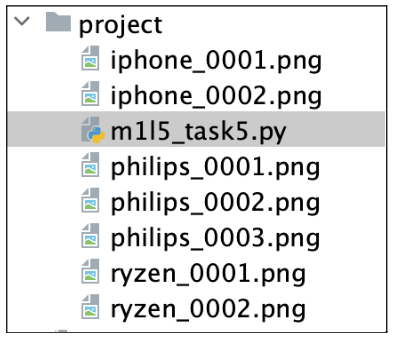
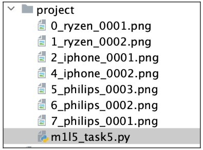
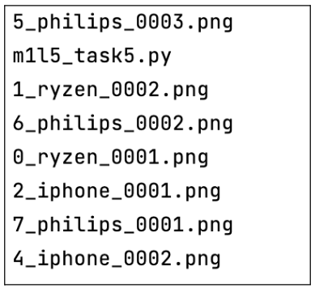
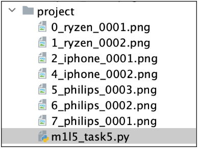
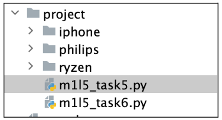
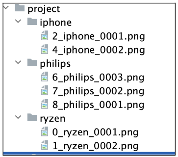

## [Задание 2.1 - Восстановим формат](#task_1)
## [Задание 2.2 - Восстановим формат 2](#task_2)

#### [_Ссылка на онлайн интерпретатор_](https://www.online-python.com/)
_________________________________________
_________________________________________

### Задание 1 - _Восстановим формат_ <a name="task_1"></a>
СУПЕР! Теперь начнем заниматься восстановлением формата.  
Циклически переберем все изображения с расширением **.png** в текущей директории и 
переименуем их в формат **{INT}_{FILENAME}**, где **INT** – итерационная переменная цикла,
**FILENAME** – первоначальное имя файла (вместе с расширением).

После выполнения скрипта, если все получилось успешно, вы увидите, 
что все изображения с расширением **.png** получили такой формат 
(например, файл **ryzen_0001.png** теперь имеет имя **0_ryzen_0001.png**). 
Затем обновите информацию о списке файлов в директории и выведите их на экран

Для переименования файла воспользуйтесь методом `os.rename()`


#### Прекод:
```python
import os

# Получение списка имен файлов
filenames = os.listdir(os.getcwd())

# Переименование файлов в формат: {i}_{filename}
# Циклический перебор элементов списка
# Ваш код

# Получим новые имена файлов
filenames = ... # Ваш код

# Вывод имен файлов на экран
for filename in filenames:
   print(filename)
```

#### Пример программы:
> 
> 
> 
> 

_________________________________________
_________________________________________
### Задание 2 - _Восстановим формат 2_<a name="task_2"></a>
Осталось теперь все файлы разместить по директориям!

Напишите скрипт, который итерационно по всем изображениям с расширением **.png** в 
текущей директории получит идентификаторы товаров (**iphone**, **philips**, **ryzen**), 
затем создаст папку с именем идентификатора товара, а затем переместит файл в эту папку:

Если папка уже существует – не создаем ее еще раз, иначе скрипт выдаст ошибку.  
Для этого воспользуйтесь под-модулем `os.path` и методом `exists` (`os.path.exists()`), 
который принимает имя директории и возвращает булево значение – `True` или `False`

Для создания директории, воспользуйтесь методом `os.mkdir()`

Если вы хотите быстро переместить файл в директорию, воспользуйтесь методом `os.rename()` 
из прошлого задания, но теперь к имени файла добавьте имя существующей директории 
вначале (например, к файлу **0_ryzen_0001.png** добавьте **ryzen**: `ryzen/0_ryzen_0001.png`, 
файл автоматически окажется в указанной директории).

_**Примечание:**_  
используйте измененные файлы из прошлого задания.


#### Прекод:
```python
import os

filenames = ...  # Получение списка имен файлов

# Перемещение изображений в директорию images
for filename in filenames:
   if filename.endswith('.png'): ...
       # Получим идентификатор продукта из имени файла (метод split() и символ для среза)
       # Ваш код

       # Создание директории для файлов с именем images (если ее нет)
       # Используйте метод os.mkdir()
       # Ваш код

       # Использование метода os.rename()
       # Ваш код
```

#### Примеры программы:
> 
> 
> 

_________________________________________
_________________________________________
