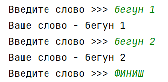
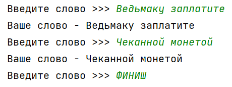
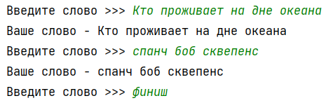
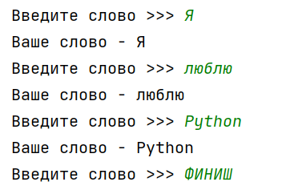

## [Задание 1.1 - Большой финиш](#task_1)
## [Задание 1.2 - Любой финиш](#task_2)
## [Задание 1.3 - Только на 5](#task_3)
## [Задание 1.4 - Сложи их все](#task_4)
## [Задание 1.5 - Правильные оценки](#task_5)

#### [_Ссылка на онлайн интерпретатор_](https://www.online-python.com/)
_________________________________________
_________________________________________

### Задание 1 - _Большой финиш_ 
На вход программе подаются слова, программа должна выводить каждое слово на отдельной строке, пока не будет введено слово `ФИНИШ`

**Формат входных данных:**  
На вход программе подаётся последовательность слов, каждое на отдельной строке

**Формат выходных данных:**  
Программа выводить последовательность в соответствии с условием задачи.

#### Примеры программы:
> 
> 

_________________________________________
_________________________________________
### Задание 2 - _Любой финиш_
На вход программе подаются слова, программа должна выводить каждое слово на отдельной строке пока не будет введено слово `ФИНИШ` или слово `финиш` 

**Формат входных данных**  
На вход программе подаётся последовательность слов, каждое на отдельной строке

**Формат выходных данных**  
Программа выводить последовательность в соответствии с условием задачи.

#### Примеры программы:
> 
> 
_________________________________________
_________________________________________
### Задание 3 - _Только на 5_
На вход программе подаётся последовательность целых чисел **делящихся** на **5**, каждое число на отдельной строке.  
Концом последовательности является любое число **НЕ** делящееся на **5**. 

Напишите программу, которая выводит члены данной последовательности.

**Формат входных данных:**  
На вход программе подается последовательность чисел, каждое число на отдельной строке.

**Формат выходных данных:**  
ППрограмма должна вывести члены данной последовательности.

#### Пример программы:
> 

_________________________________________
_________________________________________
### Задание 4 - _Сложи их все_
На вход программе подается последовательность целых чисел, каждое число на отдельной строке.  
Концом последовательности является любое **отрицательное число**. 

Напишите программу, которая выводит сумму всех членов данной последовательности.

**Формат входных данных:**  
На вход программе подается последовательность чисел, каждое число на отдельной строке.

**Формат выходных данных:**  
Программа должна вывести сумму членов данной последовательности.

#### Пример программы:
> 

_________________________________________
_________________________________________
### Задание 5 - _Правильные оценки_
На вход программе подается последовательность целых чисел от **1** до **5**, характеризующее оценку ученика, каждое число на отдельной строке.  
Концом последовательности является любое **отрицательное** число, либо число **большее 5**. 

Напишите программу, которая выводит количество пятерок

**Формат входных данных:**  
На вход программе подается последовательность чисел, каждое число на отдельной строке.

**Формат выходных данных:**  
Программа должна вывести количество пятерок.

#### Пример программы:
> 

_________________________________________
_________________________________________
