## [Задание 2.1 - Ведьмаку заплатите чеканной монетой](#task_1)
## [Задание 2.2 - Числовое зеркало](#task_2)
## [Задание 2.3 - Числа в числе](#task_3)
## [Задание 2.4 - Анализируй это](#task_4)
## [Задание 2.5 - Вторая с начала](#task_5)
## [Задание 2.6 - Все как один](#task_6)
## [Задание 2.7 - Порядок важен](#task_7)

#### [_Ссылка на онлайн интерпретатор_](https://www.online-python.com/)
_________________________________________
_________________________________________

### Задание 1 - _Ведьмаку заплатите чеканной монетой_ 
Всем известно, что ведьмак способен одолеть любых чудовищ, однако его услуги обойдутся недешево, к тому же ведьмак не принимает купюры, он принимает только чеканные монеты.  
В мире ведьмака существуют монеты с номиналами **1, 5, 10, 25**.

Напишите программу, которая определяет какое минимальное количество чеканных монет нужно заплатить ведьмаку.

**Формат входных данных**  
На вход программе подается одно натуральное число, **цена** за услугу ведьмака.

**Формат выходных данных**  
Программа должна вывести минимально возможное количество чеканных монет для оплаты.

#### Примеры программы:
> 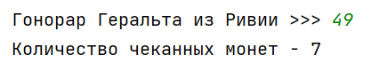
> 
> 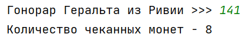
_________________________________________
_________________________________________
### Задание 2 - _Числовое зеркало_
Дано натуральное число. Напишите программу, которая меняет порядок цифр числа на обратный.

**Формат входных данных**  
На вход программе подается одно натуральное число.

**Формат выходных данных**  
Программа должна вывести число, записанное в обратном порядке.

#### Пример программы:
>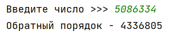
> 
> 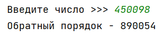

_________________________________________
_________________________________________
### Задание 3 - _Числа в числе_
Дано натуральное число. Напишите программу, которая определяет его максимальную и минимальную цифры.

**Формат входных данных**  
На вход программе подается одно натуральное число.

**Формат выходных данных**  
Программа должна вывести максимальную и минимальную цифры введенного числа (_с поясняющей надписью_).

#### Пример программы:
> 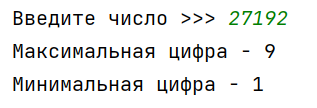
> 
> 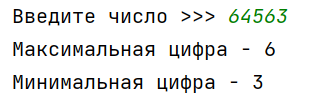

_________________________________________
_________________________________________
### Задание 4 - _Анализируй это_
На вход программе подается одно число программа должна вывести:
- Количество цифр 
- Сумму первой и последней 
- Сумму всех цифр 
- Произведение всех цифр 
- Первую цифру 
- Последнюю цифру

**Формат входных данных**  
На вход программе подается одно натуральное число.

**Формат выходных данных**  
Программа должна вывести значения указанных величин в указанном порядке.

#### Пример программы:
>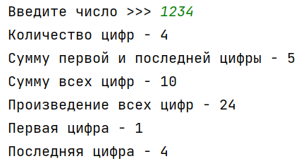
> 
>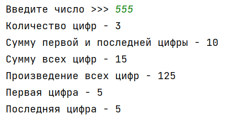

_________________________________________
_________________________________________

### Задание 5 - _Вторая с начала_ 
Дано натуральное число.  
Напишите программу, которая определяет его **вторую** (_с начала_) цифру.

**Формат входных данных**  
На вход программе подается одно натуральное число, состоящее как минимум из двух цифр.

**Формат выходных данных**  
Программа должна вывести его **вторую** (_с начала_) цифру.

#### Пример программы:
>
> 
>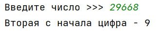

_________________________________________
_________________________________________

### Задание 6 - _Все как один_ 
Дано натуральное число. Напишите программу, которая определяет, состоит ли указанное число из **одинаковых** цифр.

**Формат входных данных**  
На вход программе подается одно натуральное число.

**Формат выходных данных**  
Программа должна вывести `YES` если число состоит из одинаковых цифр и `NO` в противном случае.

#### Пример программы:
>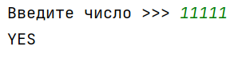
> 
>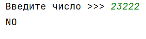

_________________________________________
_________________________________________

### Задание 7 - _Порядок важен_ 
Дано натуральное число.  
Напишите программу, которая определяет, является ли последовательность его цифр при просмотре **справа налево упорядоченной по не убыванию**.

**Формат входных данных**  
На вход программе подается одно натуральное число.

**Формат выходных данных**  
Программа должна вывести `YES` если последовательность его цифр при просмотре справа налево является упорядоченной по не убыванию  
и `NO` в противном случае.

#### Пример программы:

>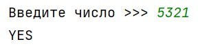
> 
>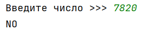

_________________________________________
_________________________________________