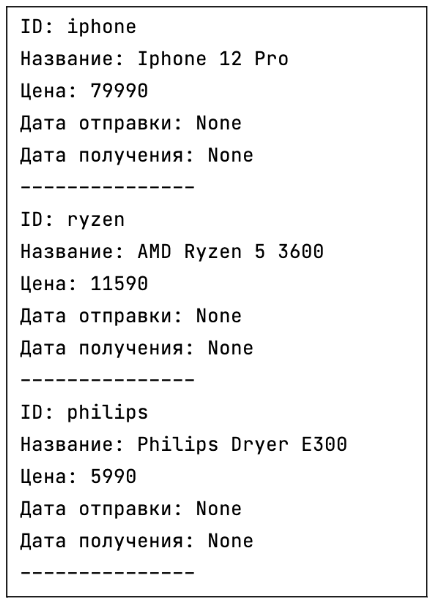
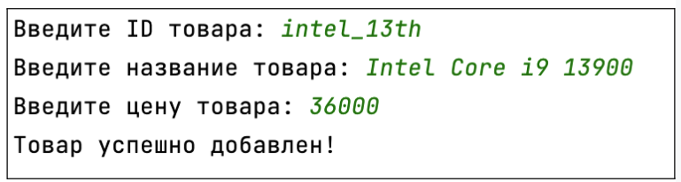

## [Задание 1.1 - Просмотр товаров в пункте выдачи](#task_1)
## [Задание 1.2 - Подъехали еще товары](#task_2)

#### [_Ссылка на онлайн интерпретатор_](https://www.online-python.com/)
_________________________________________
_________________________________________

### Задание 1 - _Просмотр товаров в пункте выдачи_ <a name="task_1"></a>
Как нам известно, маркетплейс расширяется и создает свои пункты выдачи товаров для своих клиентов. 
На один из таких должны были прийти товары. Давайте посмотрим, что там хранится!

Необходимо написать программу, которая будет читать информацию из **JSON** файла и выводить ее в консоль для пользователя.


_**Примечание:**_  
на диске в папке хранится файл **products.json**, 
перед выполнением задания убедитесь, что файл находится 
на компьютерах учеников в той же директории, что и скрипт.


#### Прекод:
```python
import json

# Открываем файл с данными
with open('products.json', 'r') as f:
   # Загружаем данные из файла
   # Ваш код

# Выводим информацию о продуктах на экран
for product in products['products']:
   # Ваш код
```

#### Пример программы:
> 
_________________________________________
_________________________________________
### Задание 2 - _Подъехали еще товары_<a name="task_2"></a>
Склад бывает даже в пункте выдачи, представляете? Мы тоже!
Товары постоянно поступают к своим новым обладателям.

Необходимо написать программу, которая будет добавлять новый товар на склад пункта выдачи. 
Программа читает информацию из актуального **JSON**-файла, а затем вносит информацию о новом товаре (*ввод через консоль*). 

Важно, чтобы для новых товаров были созданы поля `ship_date` и `delivery_date`, их значения можно установить как `None`


_**Примечание:**_  
на диске в папке хранится файл **products.json**,
перед выполнением задания убедитесь, что файл находится на компьютерах 
учеников в той же директории, что и скрипт.


#### Прекод:
```python
import json

# Открываем файл с данными
with open('products.json', 'r') as f: ...
   # Загружаем данные из файла
   # Ваш код

# Добавляем новый продукт (поля id, name, price)
id_ = input('Введите ID товара: ')
name = input('Введите название товара: ')
price = input('Введите цену товара: ')

# Добавляем новый продукт в список
# Укажите также поля ship_date и delivery_date, передайте в них пустое значение None
# Ваш код

# Открываем файл для записи
with open('products.json', 'w') as f: ...
   # Записываем данные в файл
   # Ваш код

print('Товар успешно добавлен!')
```

#### Пример программы:
> 

_________________________________________
_________________________________________


