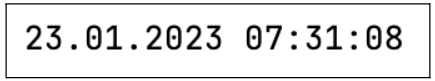
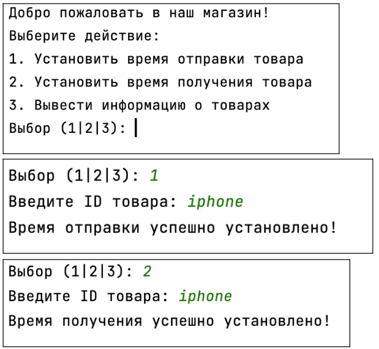
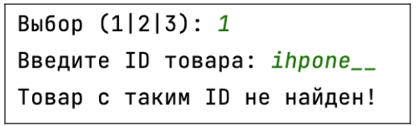
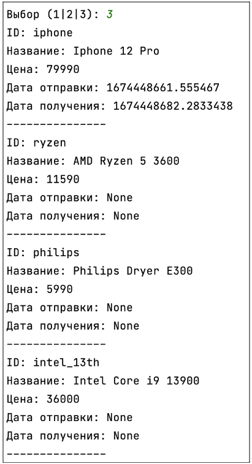

## [Задание 2.1 - Настанет день, настанет час!](#task_1)
## [Задание 2.2 - Система должна работать](#task_2)

#### [_Ссылка на онлайн интерпретатор_](https://www.online-python.com/)
_________________________________________
_________________________________________

### Задание 1 - _Настанет день, настанет час!_ <a name="task_1"></a>
Давайте все же поработаем со временем.  
Так как мы хотим автоматизировать процесс отметки о получении товара 
нашим сотрудником пункта выдачи, мы должны уметь получать 
текущее время и дату этого пункта выдачи.

Необходимо написать программу, которая будет получать текущую 
дату и время из модуля `datetime` и выводить ее в формате 
**ЧЧ.ММ.ГГГГ ЧЧ:ММ:СС** 
(в первом случае **ЧЧ** – число, во втором **ЧЧ** – часы)

_**Примечание:**_  
на диске в папке хранится файл **products.json**, 
перед выполнением задания убедитесь, что файл находится 
на компьютерах учеников в той же директории, что и скрипт.


#### Прекод:
```python
import datetime

# Получение текущей даты
now = ...  # Ваш код

# Преобразование даты в строку
now_str = ...  # Ваш код

# Вывод строки
print(now_str)
```

#### Пример программы:
> 

_________________________________________
_________________________________________
### Задание 2 - _Система должна работать_<a name="task_2"></a>
Ну что же! Завершаем систему работы пункта выдачи!

Необходимо написать программу, которая будет:
1. Брать информацию из файла **products.json**
2. Получать действие пользователя(**1** – изменить время прибытия товара на пункт выдачи; 
**2** – изменить время получения товара клиентом; **3** – вывести информацию о товарах на складе)
3. Если действия **1** или **2** – запрашивать уникальный идентификатор **ID** товара, который записан в **products.json** во всех товарах как “`id`”


Вы можете использовать любое время: 
из модуля `time` (_UNIX_) или из модуля `datetime` (точную дату в формате, как было в предыдущем задании) – оба варианта верны!

_**Примечание:**_  
на диске в папке хранится файл **products.json**, 
перед выполнением задания убедитесь, что файл находится 
на компьютерах учеников в той же директории, что и скрипт.


#### Прекод:
```python
import json
import time

# Открываем файл с данными
with open('products.json', 'r') as f:
   # Загружаем данные из файла
   # Ваш код

print('Добро пожаловать в наш магазин!')
print('Выберите действие:')
print('1. Установить время отправки товара')
print('2. Установить время получения товара')
print('3. Вывести информацию о товарах')

# Получаем действие от пользователя
action = int(input('Выбор (1|2|3): '))

if action == 1:
   # Получаем ID товара
   id_ = input('Введите ID товара: ')

   # Получаем текущее время
   current_time = ...  # Ваш код

   # Ищем товар с заданным ID
   for product in products['products']:
       if product['id'] == id_:
           # Устанавливаем время отправки
           # Ваш код
           print('Время отправки успешно установлено!')
           break
   else:
       print('Товар с таким ID не найден!')

   # Открываем файл для записи
   with open('products.json', 'w') as f:
       # Записываем данные в файл
       # Ваш код

elif action == 2:
   # Получаем ID товара
   id_ = input('Введите ID товара: ')

   # Получаем текущее время
   current_time = ...  # Ваш код

   # Ищем товар с заданным ID
   for product in products['products']:
       if product['id'] == id_:
           # Устанавливаем время получения
           # Ваш код
           print('Время получения успешно установлено!')
           break
   else:
       print('Товар с таким ID не найден!')

   # Открываем файл для записи
   with open('products.json', 'w') as f:
       # Записываем данные в файл
       # Ваш код

elif action == 3:
   # Выводим информацию о товарах на экран
   for product in products['products']:
       # Ваш код
```

#### Примеры программы:
> 
> 
> 
> 
> 

_________________________________________
_________________________________________
