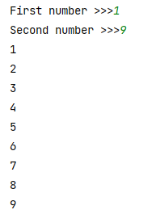
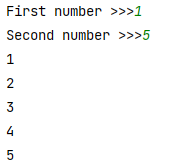
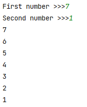
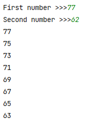
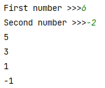
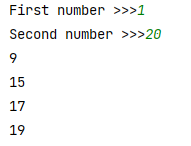
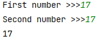
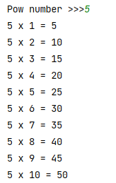
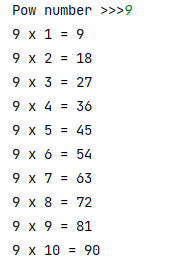

## [Задание 2.1 - Печать диапазона](#task_1)
## [Задание 2.2 - Умная печать диапазона](#task_2)
## [Задание 2.3 - Печать диапазона с шагом](#task_3)
## [Задание 2.4 - Распечатать только избранных](#task_4)
## [Задание 2.5 - Таблица умножения](#task_5)

#### [_Ссылка на онлайн интерпретатор_](https://www.online-python.com/)
_________________________________________
_________________________________________

### Задание 1 - _Печать диапазона_ 
Даны два целых числа **m** и **n** (_m≤n_).  
Напишите программу, которая выводит все числа от **m** до **n** включительно.

**Формат входных данных**  
На вход программе подаются два целых числа **m** и **n**, каждое на отдельной строке.

**Формат выходных данных**  
Программа должна вывести числа в соответствии с условием задачи.

#### Примеры программы:
> 

_________________________________________
_________________________________________
### Задание 2 - _Умная печать диапазона_
Даны два целых числа **m** и **n**. 
Напишите программу, которая выводит все числа от **m** до **n** включительно в порядке возрастания, 
если **m < n**, или в порядке убывания в противном случае.

**Формат входных данных**  
На вход программе подаются два целых числа **m** и **n**, каждое на отдельной строке.

**Формат выходных данных**  
Программа должна вывести числа в соответствии с условием задачи.

#### Пример программы:
>
> 
> 

_________________________________________
_________________________________________
### Задание 3 - _Печать диапазона с шагом_
Даны два целых числа **m** и **n** (_m > n_).  
Напишите программу, которая выводит все нечетные числа от **m** до **n** включительно в порядке убывания.

**Формат входных данных**  
На вход программе подаются два целых числа **m** и **n**, каждое на отдельной строке.

**Формат выходных данных**  
Программа должна вывести числа в соответствии с условием задачи.

**_Примечание:_** Попробуйте решить задачу двумя способами:  
с использованием условного оператора `if` и без него.

#### Пример программы:
> 
> 
> 

_________________________________________
_________________________________________
### Задание 4 - _Распечатать только избранных_
Даны два натуральных числа **m** и **n** (_m≤n_).  
Напишите программу, которая выводит все числа от **m** до **n** включительно, 
удовлетворяющие хотя бы одному из условий:
- число кратно **17**;
- число оканчивается на **9**;
- число кратно **3** и **5** одновременно

**Формат входных данных**  
На вход программе подаются два натуральных числа **m** и **n** (_m≤n_), каждое на отдельной строке.

**Формат выходных данных**  
Программа должна вывести числа в соответствии с условием задачи.

#### Пример программы:
>
> 
>

_________________________________________
_________________________________________

### Задание 5 - _Таблица умножения_ 
Дано натуральное число **n**.  
Напишите программу, которая выводит таблицу умножения на **n**.

**Формат входных данных**  
На вход программе подается натуральное число.

**Формат выходных данных**  
Программа должна вывести таблицу умножения на введенное число.

**_Примечание:_** В качестве знака умножения используйте английскую букву **x**.

#### Пример программы:
>
> 
>

_________________________________________
_________________________________________