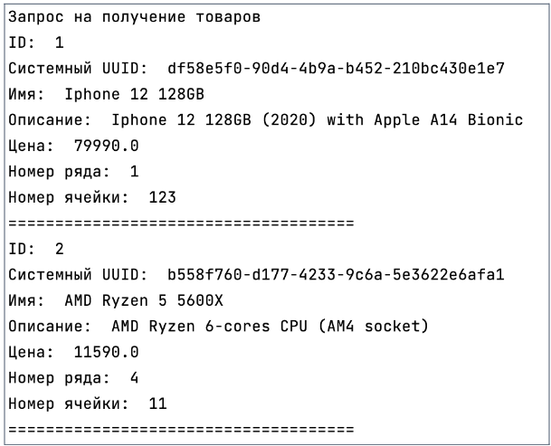
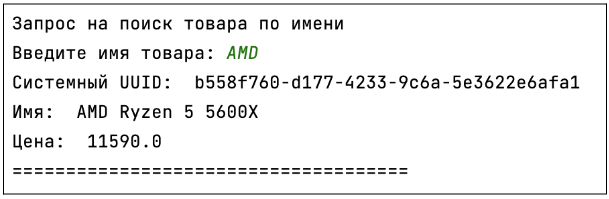
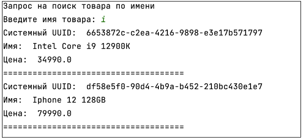

## [Задание 1.1 - Получение списка товаров из API](#task_1)
## [Задание 1.2 - Поиск товаров по вхождениям](#task_2)
## [Задание 1.3 - Удаление товара](#task_3)

#### [_Ссылка на онлайн интерпретатор_](https://www.online-python.com/)
_________________________________________
_________________________________________

### Задание 1 - _Получение списка товаров из API_ <a name="task_1"></a>
Теперь, благодаря вашим усилиям, мы наконец-то смогли собрать все сервисы в единую систему! 
Ну и настал черед изменить инфраструктуру и логику работы так, чтобы все программы работали с API. 

Для начала, напишите программу, которая получит список всех товаров от сервера.


_**Примечание:**_  
Выполнение задачи с помощью URL-адреса из презентации. 
Описание работы методов находится в разделе _Собеседование_ в презентации к уроку.


#### Прекод:
```python
import requests


URL = "http://futurelevator.sami-znaete-kto.ru:5000"


def pretty_print(response_json):
    print("ID: ", response_json["id"])
    print("Системный UUID: ", response_json["uuid"])
    print("Имя: ", response_json["name"])
    print("Описание: ", response_json["description"])
    print("Цена: ", response_json["price"])
    print("Номер ряда: ", response_json["row_id"])
    print("Номер ячейки: ", response_json["cell_id"])
    print("=====================================")


# Запрос на получение товаров
response = ... # Ваш код здесь
print("Запрос на получение товаров")
if response.status_code == 200:
    ... # Ваш код здесь
else:
    print("Ошибка: ", response.status_code)
```

#### Пример программы:
> 
_________________________________________
_________________________________________
### Задание 2 - _Поиск товаров по вхождениям_<a name="task_2"></a>
Мы так благодарны вам, что теперь еще и реализовали поиск товаров прямо на сервере. 
Теперь все, что нужно – ввести часть слова для поиска, а в ответ сервер вернет все товары, 
в имени которых встречается эта часть.

Напишите программу, которая могла бы помочь пользователю через интерфейс консоли искать товары 
в базе через запрос к API. 

_**Примечание:**_  
Выполнение задачи с помощью URL-адреса из презентации. 
Описание работы методов находится в разделе _Собеседование_ в презентации к уроку.


#### Прекод:
```python
import requests


URL = "http://futurelevator.sami-znaete-kto.ru:5000"


def pretty_print(response_json):
    print("Системный UUID: ", response_json["uuid"])
    print("Имя: ", response_json["name"])
    print("Цена: ", response_json["price"])
    print("=====================================")


# Запрос на поиск товара по имени
print("Запрос на поиск товара по имени")
name = input("Введите имя товара: ")
response = # Ваш код здесь
if response.status_code == 200:
    ... # Ваш код здесь
else:
    print("Ошибка: ", response.status_code)
    print(response.json())
```

#### Пример программы:
> 
> 

_________________________________________
_________________________________________
### Задание 3 - _Удаление товара_<a name="task_3"></a>
Не успели еще ничего добавить, как уже надо удалить?  
Да! Быть может, у вас получится удалить товар, если он еще хранится в базе.
А если нет, сервер всегда предупредит вас, что такого товара не существует, а значит и его удаление невозможно.  
**(Начните с ID 4, а как перейдете ко второй части, можете вводить новые ID, 
которые сервер отправит вам на ваши запросы в дальнейшем)**

Напишите программу, которая может удалить товар из базы данных склада, используя HTTP-запросы к апи.

_**Примечание:**_  
Выполнение задачи с помощью URL-адреса из презентации. 
Описание работы методов находится в разделе _Собеседование_ в презентации к уроку.


#### Прекод:
```python
import requests


URL = "http://futurelevator.sami-znaete-kto.ru:5000"

# Запрос на удаление товара
print("Запрос на удаление товара")
_id = int(input("Введите ID товара: "))
response = ... # Ваш код здесь
if response.status_code == 204:
    print("Товар успешно удален")
else:
    print("Ошибка: ", response.status_code)
    print(response.json())
```

_________________________________________
_________________________________________


