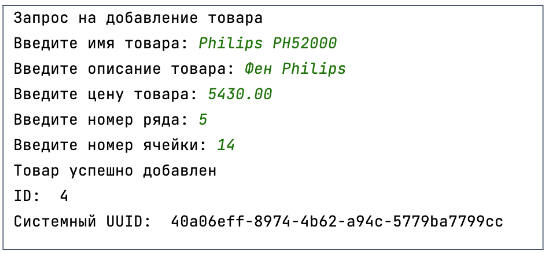

## [Задание 2.1 - Добавление товаров](#task_1)
## [Задание 2.2 - Изменение информации](#task_2)

#### [_Ссылка на онлайн интерпретатор_](https://www.online-python.com/)
_________________________________________
_________________________________________

### Задание 1 - _Добавление товаров_ <a name="task_1"></a>
Ну что, попробуем еще раз, но теперь с нашим супер классным API? 

Напишите программу, которая добавит товар в базу, используя HTTP-запрос к API.


_**Примечание:**_  
Выполнение задачи с помощью URL-адреса из презентации. 
Описание работы методов находится в разделе _Собеседование_ в презентации к уроку.


#### Прекод:
```python
import requests


URL = "http://futurelevator.sami-znaete-kto.ru:5000"

# Запрос на добавление товара
print("Запрос на добавление товара")
name = input("Введите имя товара: ")
description = input("Введите описание товара: ")
price = float(input("Введите цену товара: "))
row_id = int(input("Введите номер ряда: "))
cell_id = int(input("Введите номер ячейки: "))

simple_id = name.lower().replace(" ", "_")

product_body = {
   ... # Ваш код здесь
}

response = ... # Ваш код здесь
if response.status_code == 201:
    print("Товар успешно добавлен")
    print("ID: ", response.json()["id"])
    print("Системный UUID: ", response.json()["uuid"])
else:
    print("Ошибка: ", response.status_code)
    print(response.json())
```

#### Пример программы:
> 

_________________________________________
_________________________________________
### Задание 2 - _Изменение информации_<a name="task_2"></a>
Система пунктов выдачи тоже не стоит на месте.  
Напишите программу, которая будет ставить метки времени отправки и получения товара через HTTP-запросы к API, 
используя выбор пользователя в действии (**action** – **ship** или **delivery**)


_**Примечание:**_  
Выполнение задачи с помощью URL-адреса из презентации. 
Описание работы методов находится в разделе _Собеседование_ в презентации к уроку.


#### Прекод:
```python
import requests


URL = "http://futurelevator.sami-znaete-kto.ru:5000"

# Запрос на изменение даты отправки и получения товара
print("Запрос на изменение даты отправки и получения товара")
action = input("Введите действие (ship или delivery): ")
_id = int(input("Введите ID товара: "))

if action == "ship":
    response = ... # Ваш код здесь
    if response.status_code == 204:
        print("Дата отправки успешно изменена")
    else:
        print("Ошибка: ", response.status_code)
        print(response.json())
elif action == "delivery":
    response = ... # Ваш код здесь
    if response.status_code == 204:
        print("Дата получения успешно изменена")
    else:
        print("Ошибка: ", response.status_code)
        print(response.json())
```

#### Примеры программы:
> 
> 
> 
> 
> 

_________________________________________
_________________________________________
