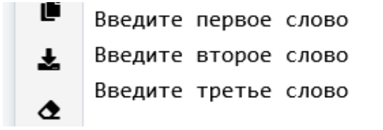
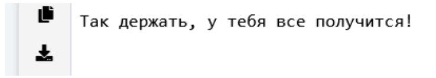
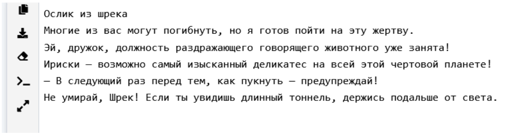

## [Задание 1 - Исправьте программу](#task_1)
## [Задание 2 - Исправьте программу](#task_2)
## [Задание 3 - Поприветствуйте мир](#task_3)
## [Задание 4 - Последовательность чисел](#task_4)
## [Задание 5 - Красивая последовательность чисел](#task_5)
## [Задание 6 - Топ фразы](#task_6)

#### [_Ссылка на онлайн интерпретатор_](https://www.online-python.com/)
_________________________________________
_________________________________________

### Задание 1 - _Исправьте программу_ <a name="task_1"></a>
Исправьте ошибки в коде и запустите программу.
#### Прекод:
```python
print(Введите первое слово)
Print("Введите второе слово")
print('Введите третье слово')
```

#### Пример программы:

_________________________________________
_________________________________________
### Задание 2 - _Исправьте программу_<a name="task_2"></a>
Удалите лишнюю строку из предложенной программы и запустите её:
#### Прекод:
```python
a = "Так держать, у тебя все получится!"
b = a
print(a)
```

#### Пример программы:

_________________________________________
_________________________________________
### Задание 3 - _Поприветствуйте мир_<a name="task_3"></a>
Напишите программу, которая выводит на экран текст **«Привет. Мир!»** (без кавычек).

#### Пример программы:
```
Hello world!
```
_________________________________________
_________________________________________
### Задание 4 - _Последовательность чисел_<a name="task_4"></a>
Напишите программу, которая выводит последовательность чисел от одного до десяти 
(**1 2 3 4 5 6 7 8 9 10**) с одним пробелом между ними.

#### Пример программы:
```
1 2 3 4 5 6 7 8 9 10
```
_________________________________________
_________________________________________
### Задание 5 - _Красивая последовательность чисел_<a name="task_5"></a>
 Измените предыдущую программу так, чтобы каждое число последовательности 
 (**1 2 3 4 5 6 7 8 9 10**) печаталось на отдельной строке.
#### Пример программы:
```
1
2
3
4
5
6
7
8
9
10
```
_________________________________________
_________________________________________
### Задание 6 - _Топ фразы_<a name="task_6"></a>
Напишите программу, которая выводит знаменитые фразы 
вашего любимого героя фильмов, сериалов, мультфильмов или аниме (не менее 5 фраз)
#### Пример программы:



