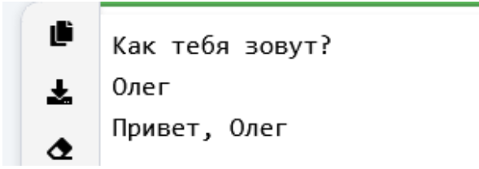
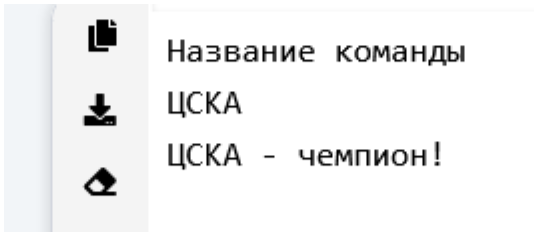
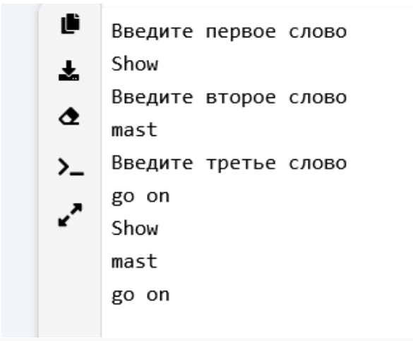
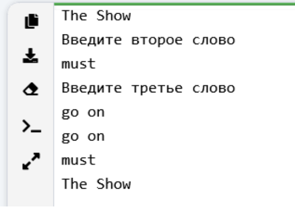
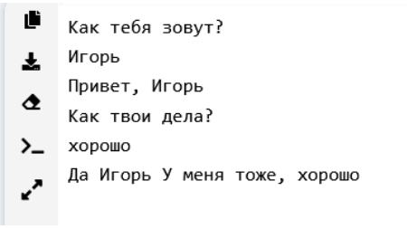

## [Задание 1 - Звёздный треугольник](#task_1)
## [Задание 2 - Давайте знакомиться](#task_2)
## [Задание 3 - Кто чемпион](#task_3)
## [Задание 4 - Повтори за мной](#task_4)
## [Задание 5 - Обратный порядок](#task_5)
## [Задание 6 - Давайте поговорим](#task_6)
## [Задание 7 - Давайте поговорим побольше](#task_7)

#### [_Ссылка на онлайн интерпретатор_](https://www.online-python.com/)
_________________________________________
_________________________________________

### Задание 1 - _Звёздный треугольник_<a name="task_1"></a>
Напишите программу, которая печатает треугольник, 
состоящий из звездочек (*) по строкам:
#### Прекод:
```
*
**
***
****
*****
******
*****
****
***
**
*
```
_________________________________________
_________________________________________
### Задание 2 - _Давайте знакомиться_<a name="task_2"></a>
На вход программе подается строка текста – имя человека. 
Напишите программу, которая выводит на экран приветствие в виде слова «Привет» (без кавычек), после которого должна стоять запятая и пробел, 
а затем введенное имя.
#### Пример программы:

_________________________________________
_________________________________________
### Задание 3 - _Кто чемпион_<a name="task_3"></a>
На вход программе подается строка текста – название хоккейной 
команды. Напишите программу, которая повторяет ее на экране со словами 
« - чемпион!» (без кавычек).
#### Пример программы:

_________________________________________
_________________________________________
### Задание 4 - _Повтори за мной_<a name="task_4"></a>
Напишите программу, которая считывает три строки по очереди, 
а затем выводит их в той же последовательности, каждую на отдельной строчке.
#### Пример программы:

_________________________________________
_________________________________________
### Задание 5 - _Обратный порядок_<a name="task_5"></a>
Напишите программу, которая считывает три строки по очереди, 
а затем выводит их в обратной последовательности, каждую на отдельной строчке.
#### Пример программы:

_________________________________________
_________________________________________
### Задание 6 - _Давайте поговорим_<a name="task_6"></a>
Напишите программу, которая строит простой диалог с 
пользователем длиной не менее 8 предложений.
#### Пример программы:


_________________________________________
_________________________________________
### Задание 7 - _Давайте поговорим побольше_<a name="task_7"></a>
Измените предыдущую программу, добавив в нее больше вариантов 
вопросов и ответов и поменяйтесь компьютерами с вашим соседом, 
чтобы каждый мог протестировать работу программ друг друга
