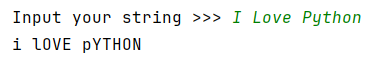
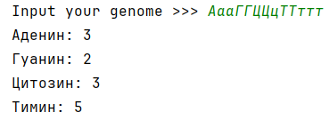

## [Задание 1.1 - Инверсия регистра](#task_1)
## [Задание 1.2 - 50 оттенков позитивного](#task_2)
## [Задание 1.3 - Мои маленькие](#task_3)
## [Задание 1.4 - Уровень многословности](#task_4)
## [Задание 1.5 - Состав генома](#task_5)
## [Задание 1.6 - Очень странные сообщения](#task_6)

#### [_Ссылка на онлайн интерпретатор_](https://www.online-python.com/)
_________________________________________
_________________________________________

### Задание 1 - _Инверсия регистра_ 
На вход программе подается строка. Напишите программу, которая меняет регистр символов, 
другими словами замените все строчные символы заглавными и наоборот.

**Формат входных данных**
На вход программе подается одна строка.

**Формат выходных данных:**  
Программа должна вывести строку в соответствии с условием задачи

#### Примеры программы:
> 
> 
> 

_________________________________________
_________________________________________
### Задание 2 - _50 оттенков позитивного_
На вход программе подается строка текста. Напишите программу, 
которая определяет является ли оттенок текста хорошим или нет.   
Текст имеет хороший оттенок, если содержит подстроку «`хорош`» во всевозможных регистрах.

**Формат входных данных**  
На вход программе подается строка текста.

**Формат выходных данных**  
Программа должна вывести «`YES`» если текст имеет хороший оттенок и «`NO`» в противном случае.

#### Примеры программы:
> 
> 
> 

_________________________________________
_________________________________________
### Задание 3 - _Мои маленькие_
На вход программе подается строка.  
Напишите программу, которая подсчитывает количество буквенных символов в нижнем регистре.

**Формат входных данных**  
На вход программе подается строка.

**Формат выходных данных:**  
Программа должна вывести количество буквенных символов в нижнем регистре.

#### Пример программы:
> 

_________________________________________
_________________________________________
### Задание 4 - _Уровень многословности_
На вход программе подается строка текста, состоящая из слов, разделенных ровно одним пробелом.  
Напишите программу, которая подсчитывает количество слов в ней.

**Формат входных данных:**  
На вход программе подается одна строка.

**Формат выходных данных:**  
Программа должна вывести количество слов.

**_Примечание:_** Строка текста не содержит пробелов в начале и конце. Используйте для решения задачи метод `count`.

#### Пример программы:
> 
> 
> 

_________________________________________
_________________________________________
### Задание 5 - _Состав генома_
На вход программе подается строка генетического кода, состоящая из букв:
- **А** (_аденин_) 
- **Г** (_гуанин_) 
- **Ц** (_цитозин_) 
- **Т** (_тимин_)  
Напишите программу, которая подсчитывает сколько _аденина_, _гуанина_, _цитозина_ и _тимина_ входит в данную строку генетического кода.

**Формат входных данных**  
На вход программе подается строка генетического кода, состоящая из символов **А**, **Г**, **Ц**, **Т**, **а**, **г**, **ц**, **т**.

**Формат выходных данных:**  
Программа должна вывести сколько _гуанина_, _тимина_, _цитозина_, _аденина_ входит в данную строку генетического кода.

#### Пример программы:
> 

_________________________________________
_________________________________________
### Задание 6 - _Очень странные сообщения_
_**Джим Хоппер**_ с помощью радиоприемника пытается получить сообщение **_Оди_**. 
На приемник ему поступает **n** различных последовательностей кода _Морзе_. 
Декодировав их, он получает последовательности из _цифр_ и _строчного латинского алфавита_, 
при этом во всех сообщениях Оди содержится число **11**, причем минимум **3** раза.   
Помогите определить **_Джиму_** количество сообщений от **_Оди_**.

**Формат входных данных**  
В первой строке подается число **n** – количество сообщений, в последующих n строках вводятся строки, содержащие латинские строчные буквы и цифры.

**Формат выходных данных:**  
Программа должна вывести количество строк в которых содержится число **11** минимум **3** раза.

**_Примечание:_** Числа **11** необязательно должны быть разделены другими символами, 
нужно подсчитать вхождение последовательности символов "**11**",  
т.е. например в строке "**111**" содержится одна такая последовательность,
в то время как в "**1111**" их уже две.

#### Пример программы:
> 
_________________________________________
_________________________________________
