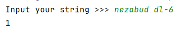
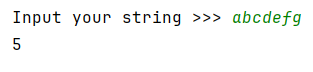
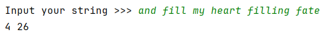
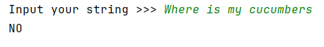
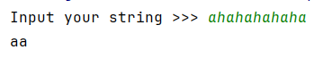

## [Задание 2.1 - Считаем цифры](#task_1)
## [Задание 2.2 - Следите за f](#task_2)
## [Задание 2.3 - h указатели](#task_3)
## [Задание 2.4 - format](#task_4)
## [Задание 2.5 - f - string](#task_5)


#### [_Ссылка на онлайн интерпретатор_](https://www.online-python.com/)
_________________________________________
_________________________________________

### Задание 1 - _Считаем цифры_ <a name="task_1"></a>
На вход программе подается строка текста. 
Напишите программу, которая подсчитывает количество цифр в данной строке.

**Формат входных данных**  
На вход программе подается строка текста.

**Формат выходных данных**  
Программа должна вывести количество цифр в данной строке.


#### Примеры программы:
> 

_________________________________________
_________________________________________
### Задание 2 - _Следите за f_<a name="task_2"></a>
На вход программе подается строка текста. 
Если в этой строке буква «**f**» встречается только один раз, выведите её индекс. 
Если она встречается **_два и более раз_**, выведите индекс её первого и последнего вхождения на одной строке, разделенных символом пробела.
Если буква «**f**» в данной строке не встречается, следует вывести «`NO`».

**Формат входных данных**  
На вход программе подается строка текста.

**Формат выходных данных**  
Программа должна вывести текст в соответствии с условием задачи.


#### Пример программы:
>
> 
> 
> 
> 

_________________________________________
_________________________________________
### Задание 3 - _h указатели_<a name="task_3"></a>
На вход программе подается строка текста, в которой буква «**h**» встречается минимум два раза.   
Напишите программу, которая удаляет из этой строки первое и последнее вхождение буквы «**h**», а также все символы, находящиеся между ними.

**Формат входных данных**  
На вход программе подается строка текста.

**Формат выходных данных**  
Программа должна вывести текст в соответствии с условием задачи.


#### Пример программы:
> 


_________________________________________
_________________________________________
### Задание 4 - _format_<a name="task_4"></a>
Напишите код, используя форматирование строк с помощью метода format, так чтобы он вывел текст: 
`In 2010, someone paid 10k Bitcoin for two pizzas.`

```python
year = 2010
amount = '10K'
currency = 'Bitcoin'
```

_________________________________________
_________________________________________
### Задание 5 - _f - string_ <a name="task_5"></a>
Дополните приведенный код, используя форматирование строк с помощью f-строк, так чтобы он вывел текст: 
`In 2010, someone paid 10K Bitcoin for two pizzas.`

```python
year = 2010
amount = '10K'
currency = 'Bitcoin'
```

_________________________________________
_________________________________________
