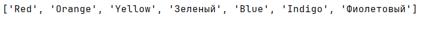
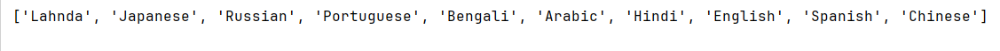

## [Задание 1.1 - Английский алфавит](#task_1)
## [Задание 1.2 - Второй с конца](#task_2)
## [Задание 1.3 - Среднее арифметическое](#task_3)
## [Задание 1.4 - Цветной микс](#task_4)
## [Задание 1.5 - Языки](#task_5)


#### [_Ссылка на онлайн интерпретатор_](https://www.online-python.com/)
_________________________________________
_________________________________________

### Задание 1 - _Английский алфавит_ <a name="task_1"></a>
На вход программе подается одно число **n**.  
Напишите программу, которая выводит список, состоящий из n букв английского алфавита `['a', 'b', 'c', ...]` в нижнем регистре.

**Формат входных данных**
На вход программе подается натуральное число **n**, **n** ≤ 26

**Формат выходных данных:**  
Программа должна вывести строку в соответствии с условием задачи.


#### Примеры программы:
> 
> 
> 

_________________________________________
_________________________________________
### Задание 2 - _Второй с конца_<a name="task_2"></a>
На вход программе подается одно число  **n > 5**.  
Сгенерируйте список с последовательностью чисел от **0** до **n - 1** 
Напишите программу, которая выводит элемент списка с индексом равным **n - 2**


**Формат входных данных**  
На вход программе подается натуральное число **n**. 

**Формат выходных данных**  
Программа должна вывести элемент с индексом на два меньший чем введенное **n** 

#### Примеры программы:
> 

_________________________________________
_________________________________________
### Задание 3 - _Среднее арифметическое_<a name="task_3"></a>
Создайте список случайных числовых значений, 
которые напишете сами. 
Напишите программу, которая будет выводить **среднее арифметическое** для чисел в этом списке 

**Формат входных данных**  
Список со случайными числовыми значениями 

**Формат выходных данных:**  
Среднее арифметическое для числовых значений в списке

#### Прекод
```python
# list example 
evens = [2, 4, 6, 8, 10, 12, 14, 16, 18, 20]
```


#### Пример программы:
> 

_________________________________________
_________________________________________
### Задание 4 - _Цветной микс_<a name="task_4"></a>
Создайте список со следующими значениями 
`rainbow = ['Red', 'Orange', 'Yellow', 'Green', 'Blue', 'Indigo', 'Violet']`   
Напишите программу, которая изменит элемент списка имеющий значение **Green**  
на значение  **Зеленый**, а элемент **Violet** на **Фиолетовый**.  
Далее необходимо вывести полученный список


#### Прекод
```python
rainbow = ['Red', 'Orange', 'Yellow', 'Green', 'Blue', 'Indigo', 'Violet']
```

#### Пример программы:
> 


_________________________________________
_________________________________________
### Задание 5 - _Языки_<a name="task_5"></a>
Создайте список со следующими значениями 
`languages = ['Chinese', 'Spanish', 'English', 'Hindi', 'Arabic', 'Bengali', 'Portuguese', 'Russian', 'Japanese', 'Lahnda']` 

Напишите программу, которая выведет элементы списка **

#### Прекод
```python
languages = ['Chinese', 'Spanish', 'English', 'Hindi', 'Arabic', 'Bengali', 'Portuguese', 'Russian', 'Japanese', 'Lahnda']
```

#### Пример программы:
> 

_________________________________________
_________________________________________
