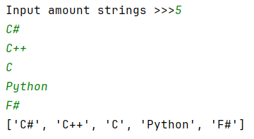
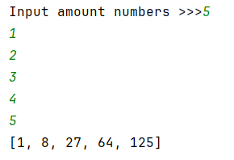
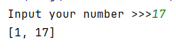
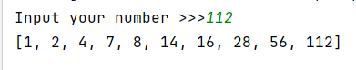
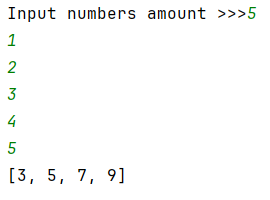

## [Задание 2.1 - Список строк](#task_1)
## [Задание 2.2 - Буквенная прогрессия](#task_2)
## [Задание 2.3 - Кубы](#task_3)
## [Задание 2.4 - Делители](#task_4)
## [Задание 2.5 - f - string](#task_5)

#### [_Ссылка на онлайн интерпретатор_](https://www.online-python.com/)
_________________________________________
_________________________________________

### Задание 1 - _ Список строк_ 
На вход программе подается натуральное число **n**, а затем **n** строк.  
Напишите программу, которая создает из указанных строк список и выводит его.

**Формат входных данных**  
На вход программе подаются натуральное число n, а затем n строк, каждая на отдельной строке.

**Формат выходных данных**  
Программа должна вывести список состоящий из указанных строк.

#### Примеры программы:
> 

_________________________________________
_________________________________________
### Задание 2 - _Буквенная прогрессия_
Напишите программу, выводящую следующий список:

`['a', 'bb', 'ccc', 'dddd', 'eeeee', 'ffffff', ...]`

**Формат выходных данных**  
Программа должна вывести указанный список.

**_Примечание:_** Последний элемент списка состоит из 26 символов z.

_________________________________________
_________________________________________
### Задание 3 - _Кубы_
На вход программе подается натуральное число **n**, а затем **n** целых чисел.  
Напишите программу, которая создает из указанных чисел список их кубов.

**Формат входных данных**  
На вход программе подаются натуральное число n, а затем n целых чисел, каждое на отдельной строке.

**Формат выходных данных**  
Программа должна вывести список, состоящий из кубов указанных чисел.

#### Пример программы:
> 

_________________________________________
_________________________________________
### Задание 4 - _Делители_
На вход программе подается натуральное число **n**.  
Напишите программу, которая создает список состоящий из делителей введенного числа

**Формат входных данных**  
На вход программе подается натуральное число **n**.

**Формат выходных данных**  
Программа должна вывести список, состоящий из делителей введенного числа.

#### Пример программы:
> 
> 
> 

_________________________________________
_________________________________________
### Задание 5 - _f - string_ 
На вход программе подается натуральное число **n≥2**, 
а затем **n** целых чисел. Напишите программу, 
которая создает из указанных чисел список, состоящий из сумм соседних чисел 
(0 и 1. 1 и 2. 2 и 3, 3 и т.д.).

**Формат входных данных**  
На вход программе подается натуральное число **n**, а затем **n** целых чисел, каждое на отдельной строке.

**Формат выходных данных**  
Программа должна вывести список, состоящий из сумм соседних чисел.

#### Пример программы:
> 

_________________________________________
_________________________________________
