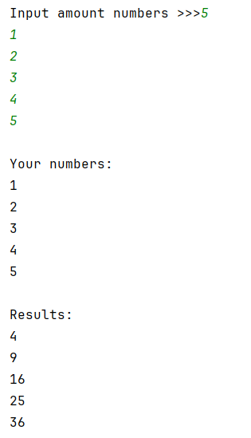
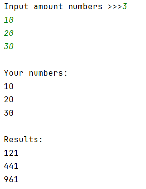
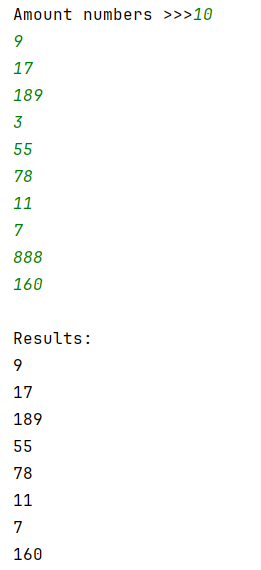
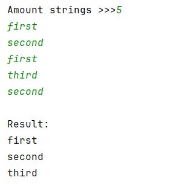
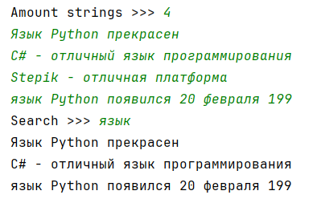
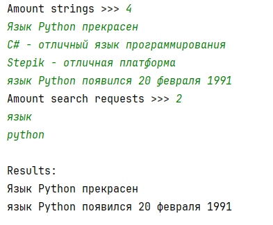
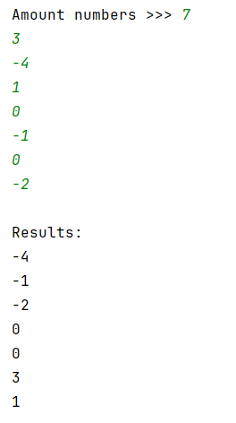

## [Задание 1.1 - Математический обработчик](#task_1)
## [Задание 1.2 - Аналитика](#task_2)
## [Задание 1.3 - Уникальные строки](#task_3)
## [Задание 1.4 - Жужль Хрум](#task_4)
## [Задание 1.5 - Жужль Хрум+](#task_5)
## [Задание 1.6 - Распределение](#task_6)
Распределение

#### [_Ссылка на онлайн интерпретатор_](https://www.online-python.com/)
_________________________________________
_________________________________________

### Задание 1 - _Математический обработчик_ 
На вход программе подается натуральное число **n**, 
а затем **n** целых чисел.  
Напишите программу, которая для каждого введенного числа **x** выводит значение 
функции $f(x) = x^2 + 2x + 1$, каждое на отдельной строке.

**Формат входных данных**
На вход программе подаются натуральное число **n**, а затем **n** целых чисел, каждое на отдельной строке.

**Формат выходных данных:**  
Программа должна вывести сначала введенные числа, затем пустую строку, а затем соответствующие значения функции.

**_Примечание:_** Для первого теста имеем: $f(1) = 1^2 + 2 ⋅ 1 + 1 = 4$

#### Примеры программы:
> 
> 
> 

_________________________________________
_________________________________________
### Задание 2 - _Аналитика_
При анализе данных, собранных в рамках научного эксперимента, 
бывает полезно удалить самое большое и самое маленькое значение.

На вход программе подается натуральное число **n**, а затем **n** различных 
натуральных чисел. 
Напишите программу, которая удаляет наименьшее и наибольшее значение из 
указанных чисел, а затем выводит оставшиеся числа каждое на отдельной строке, 
не меняя их порядок.

**Формат входных данных**  
На вход программе подаются натуральное число **n**, 
а затем **n** различных натуральных чисел, каждое на отдельной строке.

**Формат выходных данных**  
Программа должна вывести текст в соответствии с условием задачи.

#### Примеры программы:
> 

_________________________________________
_________________________________________
### Задание 3 - _Уникальные строки_
На вход программе подается натуральное число **n**, а затем **n** строк.  
Напишите программу, которая выводит только уникальные строки, 
в том же порядке.

**Формат входных данных**  
На вход программе подаются натуральное число **n**, а затем **n** строк, 
каждая на отдельной строке.

**Формат выходных данных:**  
Программа должна вывести текст в соответствии с условием задачи.

#### Пример программы:
> 

_________________________________________
_________________________________________
### Задание 4 - _Жужль Хрум_
На вход программе подается натуральное число **n**, 
затем **n** строк, затем еще одна строка — поисковый запрос. 

Напишите программу, которая выводит все введенные строки, где встречается 
поисковый запрос.

**Формат входных данных**  
На вход программе подаются натуральное число **n** — количество строк, 
затем сами строки в указанном количестве, затем один поисковый запрос.

**Формат выходных данных:**  
Программа должна вывести все введенные строки, в которых встречается поисковый запрос.

**_Примечание:_** Поиск не должен быть чувствителен к регистру символов.

#### Пример программы:
> 

_________________________________________
_________________________________________
### Задание 5 - _Жужль Хрум+_
На вход программе подается натуральное число **n**, 
затем **n** строк, затем число **k** — количество поисковых запросов, 
затем **k** строк — поисковые запросы. 

Напишите программу, которая выводит все введенные строки, где встречаются все поисковые запросы.

**Формат входных данных**  
На вход программе подаются натуральное число **n** — количество строк, 
затем сами строки в указанном количестве, затем число **k**, затем сами поисковые запросы.

**Формат выходных данных:**  
Программа должна вывести все введенные строки, в которых встречаются все поисковые запросы.

#### Пример программы:
> 

_________________________________________
_________________________________________
### Задание 6 - _Распределение_
На вход программе подается натуральное число **n**, а затем **n** целых чисел.  

Напишите программу, которая сначала выводит все отрицательные числа, затем нули,
а затем все положительные числа, каждое на отдельной строке. 
Числа должны быть выведены в том же порядке, в котором они были введены.

**Формат входных данных**  
На вход программе подаются натуральное число **n**, 
а затем **n** целых чисел, каждое на отдельной строке.

**Формат выходных данных:**  
Программа должна вывести текст в соответствии с условием задачи.

#### Пример программы:
> 

_________________________________________
_________________________________________
