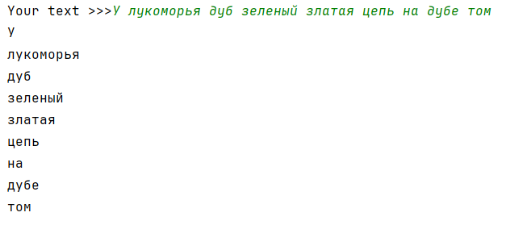
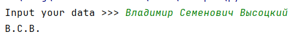
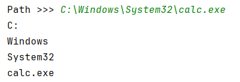
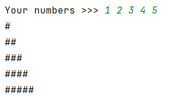
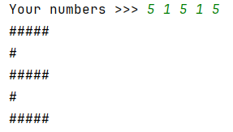
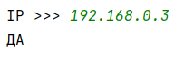
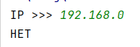
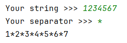
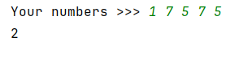

## [Задание 2.1 - Только слова](#task_1)
## [Задание 2.2 - Инициалы](#task_2)
## [Задание 2.3 - Таков путь](#task_3)
## [Задание 2.4 - Столбчатая диаграмма](#task_4)
## [Задание 2.5 - Проверка IP](#task_5)
## [Задание 2.6 - Разделитель](#task_6)
## [Задание 2.7 - Пора по парам](#task_7)

#### [_Ссылка на онлайн интерпретатор_](https://www.online-python.com/)
_________________________________________
_________________________________________

### Задание 1 - _ Только слова_ 
На вход программе подается строка текста. 
Напишите программу, которая выводит слова введенной строки в столбик.

**Формат входных данных**  
На вход программе подается строка текста.

**Формат выходных данных**  
Программа должна вывести текст в соответствии с условием задачи.

#### Примеры программы:
> 

_________________________________________
_________________________________________
### Задание 2 - _Инициалы_
На вход программе подается строка текста, содержащая _имя_, _отчество_ и _фамилию_ человека. 

Напишите программу, которая выводит инициалы человека.

**Формат входных данных**  
На вход программе подается строка текста, содержащая имя, отчество и фамилию человека.

**Формат выходных данных**  
Программа должна вывести текст в соответствии с условием задачи.

#### Примеры программы:
> 

_________________________________________
_________________________________________
### Задание 3 - _Таков путь_
В операционной системе **Windows** полное имя файла состоит из буквы диска, 
после которого ставится двоеточие и символ  `\`,  затем через такой же символ перечисляются подкаталоги (**папки**), в которых находится файл, 
в конце пишется имя файла (`C:\Windows\System32\calc.exe`).

На вход программе подается одна строка с корректным именем файла в операционной 
системе Windows. 

Напишите программу, которая разбирает строку на части, разделенные символом `\`. 
Каждую часть вывести в отдельной строке.

**Формат входных данных**  
На вход программе подается одна строка.

**Формат выходных данных**  
Программа должна вывести текст в соответствии с условием задачи.

#### Пример программы:
> 

_________________________________________
_________________________________________
### Задание 4 - _Столбчатая диаграмма_
На вход программе подается строка текста, содержащая целые числа.  
Напишите программу, которая по заданным числам строит столбчатую диаграмму.

**Формат входных данных**  
На вход программе подается строка текста, содержащая целые числа, разделенных символом пробела.

**Формат выходных данных**  
Программа должна вывести столбчатую диаграмму.

#### Пример программы:
> 
> 
> 

_________________________________________
_________________________________________
### Задание 5 - _Проверка IP_ 
На вход программе подается строка текста, 
содержащая 4 целых числа разделенных точкой. 
Напишите программу, которая проверяет, что введенная строка текста это корректный 
**ip**-адрес.

**Формат входных данных**  
На вход программе подается строка текста, содержащая 4 целых числа разделенных точкой.

**Формат выходных данных**  
Программа должна вывести `ДА`, если введенная строка является корректным ip-адресом, и `НЕТ` — в противном случае.

**_Примечание:_** ip-адрес является корректным, если все 4 числа находятся в диапазоне от 0 до 255 включительно.

#### Пример программы:
> 
> 
> 

_________________________________________
_________________________________________
### Задание 6 - _Разделитель_ 
На вход программе подается строка текста и строка разделитель. 

Напишите программу, которая вставляет указанный разделитель между каждым 
символом введенной строки текста.

**Формат входных данных**  
На вход программе подается строка текста и строка разделитель, каждая на отдельной строке

**Формат выходных данных**  
Программа должна вывести текст в соответствии с условием задачи.

#### Пример программы:
> 

_________________________________________
_________________________________________
### Задание 7 - _Пора по парам_ 
На вход программе подается строка текста, содержащая натуральные числа. 
Из данной строки формируется список чисел. 

Напишите программу, которая подсчитывает, сколько в полученном списке пар элементов, 
равных друг другу. 
Считается, что любые два элемента, равные друг другу образуют одну пару, 
которую необходимо посчитать.

**Формат входных данных**  
На вход программе подается строка текста, содержащая натуральные числа, отделенные символом пробела.

**Формат выходных данных**  
Программа должна вывести одно число – количество пар элементов, равных друг другу.

#### Пример программы:
> 

_________________________________________
_________________________________________