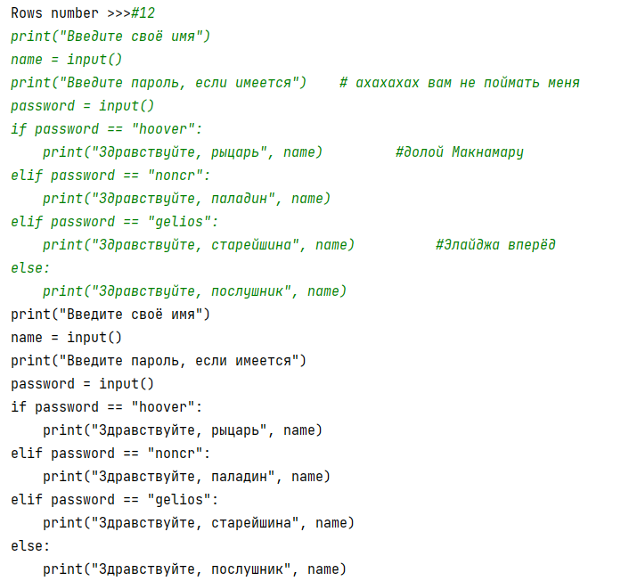

## [Задание 1.1 - Последовательность действий](#task_1)
## [Задание 1.2 - Артикулируй это](#task_2)
## [Задание 1.3 - Комментарии зло](#task_3)
## [Задание 1.4 - Вверх и вниз](#task_4)
## [Задание 1.5 - Сортировка пузырьком](#task_5)
## [Задание 1.6 - Ленивая сортировка](#task_6)


#### [_Ссылка на онлайн интерпретатор_](https://www.online-python.com/)
_________________________________________
_________________________________________

### Задание 1 - _Последовательность действий_ <a name="task_1"></a>
Дан исходный список `numbers`
```python
numbers = [8, 9, 10, 11]
```

Напишите код, который выполнит следующую последовательность действий:
1) заменит второй элемент списка на 17;
2) добавит числа **4**, **5** и **6** в конец списка;
3) удалит первый элемент списка;
4) удвоит список;
5) вставит число **25** по индексу **3**;
6) выведет список, с помощью функции `print()`

_________________________________________
_________________________________________
### Задание 2 - _Артикулируй это_<a name="task_2"></a>
На вход программе подается строка, содержащая английский текст.  
Напишите программу, которая подсчитывает общее количество артиклей: `a`, `an`, `the`.


**Формат входных данных**  
На вход программе подается строка, содержащая английский текст. Слова текста разделены символом пробела.

**Формат выходных данных**  
Программа должна вывести общее количество артиклей `a`, `an`, `the` вместе с поясняющим текстом.

**_Примечание:_** Артикли могут начинаться с заглавной буквы `A`, `An`, `The`.

#### Примеры программы для следующего текста:
```shell
William Shakespeare was born in the town of Stratford, England, in the year 1564. 
When he was a young man, Shakespeare moved to the city of London, where he began writing plays. 
His plays were soon very successful, and were enjoyed both by the common people of London and also by the rich and famous. 
In addition to his plays, Shakespeare wrote many short poems and a few longer poems. Like his plays, these poems are still famous today.
```
> 

_________________________________________
_________________________________________
### Задание 3 - _Комментарии зло_<a name="task_3"></a>
Немало известный в пустошах Мохаве Курьер забрел в Хидден-Вэли – секретный бункер Братства Стали, 
и любезно соглашается помочь им в решении их проблем.
Одной из такой проблем являлся странный компьютерный вирус, который проявлялся в виде появления 
комментариев к программам на терминалах Братства Стали. 
Известно, что программисты Братства никогда не оставляют комментарии к коду, и пишут программы на Python, 
поэтому удаление всех этих комментариев никак не навредит им.  

Помогите писцу Ибсену удалить все комментарии из программы.
 
**Формат входных данных**  
На первой строке вводится символ решётки и сразу же натуральное число **n** — количество строк в программе, не считая первой.  
Далее следует **n** строк кода.

**Формат выходных данных**  
Нужно вывести те же строки, но удалить комментарии и символы пустого пространства в конце строк. 
Пустую строку вместо первой строки ввода выводить не надо.


#### Пример программы:
> 

_________________________________________
_________________________________________
### Задание 4 - _Вверх и вниз_<a name="task_4"></a>
На вход программе подается строка текста, содержащая целые числа. 
Из данной строки формируется список чисел. 

Напишите программу, которая сортирует и выводит данный список сначала по возрастанию, а затем по убыванию.

**Формат входных данных:**  
На вход программе подается строка текста, содержащая целые числа, разделенные символом пробела.

**Формат выходных данных:**  
Программа должна вывести две строки текста в соответствии с условием задачи.


#### Пример программы:
> 

_________________________________________
_________________________________________
### Задание 5 - _Сортировка пузырьком_<a name="task_5"></a>
Вам дан исходный массив чисел


```python
array = [
    17, 24, 91, 96, 67, -27, 79, -71, -71, 58, 48, 88, 88, -16, -78, 96, 
    -76, 56, 92, 1, 32, -17, 36, 88, -61, -97, -37, -84, 50, 47, 94, -6, 
    52, -76, 93, 14, -32, 98, -65, -16, -9, -68, -20, -40, -71, 93, -91, 
    44, 25, 79, 97, 0, -94, 7, -47, -96, -55, -58, -78, -78, -79, 75, 44, 
    -56, -41, 38, 16, 70, 17, -17, -24, -83, -74, -73, 11, -26, 63, -75, 
    -19, -13, -51, -74, 21, -8, 21, -68, -66, -84, -95, 78, 69, -29, 39, 
    38, -55, 7, -11, -26, -62, -84
]
```

Напишите код который бы реализовывал алгоритм пузырьковой сортировки

_________________________________________
_________________________________________
### Задание 6 - _Ленивая сортировка_<a name="task_6"></a>
Вам дан исходный массив чисел


```python
array = [
    17, 24, 91, 96, 67, -27, 79, -71, -71, 58, 48, 88, 88, -16, -78, 96, 
    -76, 56, 92, 1, 32, -17, 36, 88, -61, -97, -37, -84, 50, 47, 94, -6, 
    52, -76, 93, 14, -32, 98, -65, -16, -9, -68, -20, -40, -71, 93, -91, 
    44, 25, 79, 97, 0, -94, 7, -47, -96, -55, -58, -78, -78, -79, 75, 44, 
    -56, -41, 38, 16, 70, 17, -17, -24, -83, -74, -73, 11, -26, 63, -75, 
    -19, -13, -51, -74, 21, -8, 21, -68, -66, -84, -95, 78, 69, -29, 39, 
    38, -55, 7, -11, -26, -62, -84
] 
```

Отсортируйте список по возрастанию, любым удобным вам образом
_________________________________________
_________________________________________
