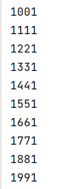
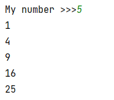
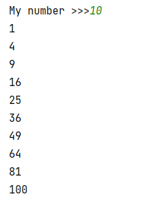
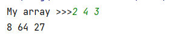
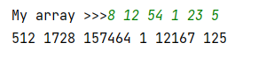
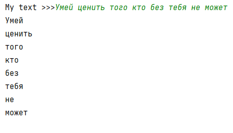
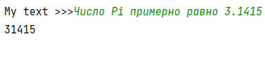
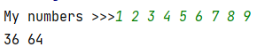

## [Задание 2.1 - Палиндромы](#task_1)
## [Задание 2.2 - Квадраты чисел](#task_2)
## [Задание 2.3 - Кубы чисел](#task_3)
## [Задание 2.4 - Башенка из слов](#task_4)
## [Задание 2.5 - Буквы в пекло](#task_5)
## [Задание 2.6 - Квадраты чисел без четвёрок](#task_6)

#### [_Ссылка на онлайн интерпретатор_](https://www.online-python.com/)
_________________________________________
_________________________________________

### Задание 1 - _Палиндромы_ 
Напишите код, используя списочное выражение, 
который выведет список всех чисел от 100 до 1000 являющихся палиндромами  

#### Примеры программы для чисел от 1000 до 2000:
> 

_________________________________________
_________________________________________
### Задание 2 - _Квадраты чисел_
На вход программе подается натуральное число **n**.  
Напишите программу, использующую списочное выражение, 
которая создает список содержащий квадраты чисел от **1** до **n**, 
а затем выводит его элементы построчно, то есть каждый на отдельной строке.

**Формат входных данных**  
На вход программе подается натуральное число.

**Формат выходных данных**  
Программа должна вывести текст в соответствии с условием задачи.

**_Примечание:_** Для вывода элементов списка используйте цикл `for`.

#### Пример программы:
>
> 
> 

_________________________________________
_________________________________________
### Задание 3 - _Кубы чисел_
На вход программе подается строка текста, содержащая целые числа.  
Напишите программу, использующую списочное выражение, которая выведет кубы указанных чисел 
также на одной строке.

**Формат входных данных**  
На вход программе подается строка текста, содержащая целые числа, разделенные символом пробела.

**Формат выходных данных**  
Программа должна вывести текст в соответствии с условием задачи.

**_Примечания:_** 
- Для вывода элементов списка используйте цикл `for`
- Используйте метод `split`

#### Пример программы:
> 
> 
> 

_________________________________________
_________________________________________
### Задание 4 - _Башенка из слов_
На вход программе подается строка текста, содержащая слова.  
Напишите программу, которая выводит слова введенной строки в **столбик**.

**Формат входных данных**  
На вход программе подается строка текста, содержащая слова, разделенные символом пробела.

**Формат выходных данных**  
Программа должна вывести текст в соответствии с условием задачи.

**_Примечание:_** Программу можно написать в одну строку кода.

#### Пример программы:
>

_________________________________________
_________________________________________
### Задание 5 - _Буквы в пекло_ 
На вход программе подается строка текста.   
Напишите программу, использующую списочное выражение, которая выводит все цифровые символы данной строки.

**Формат входных данных**  
На вход программе подается строка текста.

**Формат выходных данных**  
Программа должна вывести текст в соответствии с условием задачи.

**_Примечание:_** Программу можно написать в одну строку кода.

#### Пример программы:
>

_________________________________________
_________________________________________
### Задание 6 - _Квадраты чисел без четвёрок_ 
На вход программе подается строка текста, содержащая целые числа.  
Напишите программу, использующую списочное выражение, 
которая выведет **квадраты** **четных** чисел не оканчивающихся на цифру **4**

**Формат входных данных**  
На вход программе подается строка текста, содержащая целые числа, разделенные символом пробела.

**Формат выходных данных**  
Программа должна вывести текст в соответствии с условием задачи.

**_Примечание:_** Программу можно написать в одну строку кода.

#### Пример программы:
>

_________________________________________
_________________________________________
