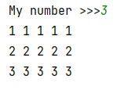
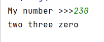
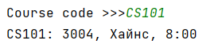
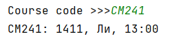
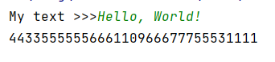
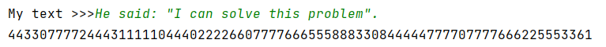

## [Задание 1.1 - Счастливая восьмёрка](#task_1)
## [Задание 1.2 - Кто не указал почту?](#task_2)
## [Задание 1.3 - Пишите буквами](#task_3)
## [Задание 1.4 - Что у нас сегодня по расписанию](#task_4)
## [Задание 1.5 - Код из 90-ых](#task_5)


#### [_Ссылка на онлайн интерпретатор_](https://www.online-python.com/)
_________________________________________
_________________________________________

### Задание 1 - _Счастливая восьмёрка_ <a name="task_1"></a>
Напишите код, который распечатает имена всех пользователей 
(в алфавитном порядке), чей телефонный номер заканчивается на 8.

Исходный словарь:


**Формат входных данных**  
На вход программе подается число от 1 до 9 

**Формат выходных данных:**  
Программа выводит таблицу указанную в условии


#### Примеры программы:
> 

_________________________________________
_________________________________________
### Задание 2 - _Кто не указал почту?_<a name="task_2"></a>
Дано натуральное число **х** от 1 до 9.  
Напишите программу, которая печатает таблицу сложения для всех чисел от **1** до **n** в соответствии 
с примером.

**Формат входных данных**  
На вход программе подается число от 1 до 9 

**Формат выходных данных**  
Программа печатает таблицу сложения для всех чисел от **1** до **n**

#### Примеры программы:
> 

_________________________________________
_________________________________________
### Задание 3 - _Пишите буквами_<a name="task_3"></a>
Дано нечетное натуральное число **х**.  
Напишите программу, которая печатает равнобедренный **звездный** треугольник с основанием, равным **х** в соответствии с примером:
```shell
*
**
***
****
***
**
*
```

**Формат входных данных**  
На вход программе подается одно **_нечетное_** натуральное число.

**Формат выходных данных:**  
Программа должна вывести треугольник в соответствии с условием.


#### Пример программы:
> 
> 
> 

_________________________________________
_________________________________________
### Задание 4 - _Что у нас сегодня по расписанию_<a name="task_4"></a>
На вход программе подается натуральное число **n**.  
Напишите программу, которая печатает численный треугольник в соответствии с примером:
```shell
1
22
333
4444
55555
```

**Формат входных данных:**  
На вход программе подается одно натуральное число.

**Формат выходных данных:**  
Программа должна вывести треугольник в соответствии с условием.


#### Пример программы:
> 
> 
> 

_________________________________________
_________________________________________
### Задание 5 - _Код из 90-ых_<a name="task_5"></a>
На вход программе подается натуральное число **n**.  
Напишите программу, которая печатает численный треугольник в соответствии с примером:
```shell
1
22
333
4444
55555
```

**Формат входных данных:**  
На вход программе подается одно натуральное число.

**Формат выходных данных:**  
Программа должна вывести треугольник в соответствии с условием.


#### Пример программы:
> 
> 
> 

_________________________________________
_________________________________________