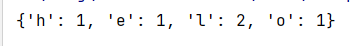
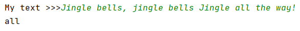
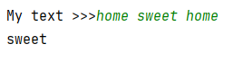
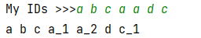
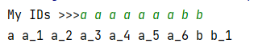

## [Задание 2.1 - Квадратные ключи](#task_1)
## [Задание 2.2 - Смерджи это](#task_2)
## [Задание 2.3 - Уникальность наше всё](#task_3)
## [Задание 2.4 - Самое частое слово](#task_4)
## [Задание 2.5 - Самое редкое слово](#task_5)
## [Задание 2.6 - Постфиксная запись](#task_6)


#### [_Ссылка на онлайн интерпретатор_](https://www.online-python.com/)
_________________________________________
_________________________________________

### Задание 1 - _Квадратные ключи_ <a name="task_1"></a>
Напишите программу, которая создаёт словарь result.  
В данном словаре ключи – это числа от 1 до 15 (включительно), 
а значения представляют собой **квадраты** ключей.

**_Примечание:_** Выводить содержимое словаря **result** не нужно, но не забудьте всё проверить.

_________________________________________
_________________________________________
### Задание 2 - _Смерджи это_<a name="task_2"></a>
Даны исходные словари.
```python
dict1 = {'a': 100, 'z': 333, 'b': 200, 'c': 300, 'd': 45, 'e': 98, 't': 76, 'q': 34, 'f': 90, 'm': 230}
dict2 = {'a': 300, 'b': 200, 'd': 400, 't': 777, 'c': 12, 'p': 123, 'w': 111, 'z': 666}
```

Напишите код, который объединит содержимое двух словарей `dict1` и `dict2` по ключам, 
складывая значения по одному и тому же ключу, в случае, если ключ присутствует в обоих словарях.  
Результирующий словарь необходимо присвоить переменной `result`.

**_Примечание:_** Выводить содержимое словаря **result** не нужно, но не забудьте всё проверить.

_________________________________________
_________________________________________
### Задание 3 - _Уникальность наше всё_<a name="task_3"></a>
Дана исходная строка 
```python
text='footballcyberpunkextraterritorialityconversationalistblockophthalmoscopicinterdependencemamauserfff'
```

Напишите код, который создаст словарь и сохранит его в переменную `result`.
В данном словаре для каждого символа строки `text` будет подсчитано количество его вхождений в словарь.


#### Пример словаря для строки `Hello`:
> 


_________________________________________
_________________________________________
### Задание 4 - _Самое частое слово_<a name="task_4"></a>
Дана исходная строка
```python
text= '''orange strawberry barley gooseberry apple apricot barley 
currant orange melon pomegranate banana banana orange barley apricot plum 
grapefruit banana quince strawberry barley grapefruit banana grapes melon strawberry apricot 
currant currant gooseberry raspberry apricot currant orange lime quince grapefruit barley banana 
melon pomegranate barley banana orange barley apricot plum banana quince lime grapefruit strawberry 
gooseberry apple barley apricot currant orange melon pomegranate banana banana orange apricot barley 
plum banana grapefruit banana quince currant orange melon pomegranate barley plum banana quince barley 
lime grapefruit pomegranate barley'''
```

Напишите код, который выведет наиболее часто встречающееся слово строки `text`. 
Если таких слов несколько, должно быть выведено то, что меньше в лексикографическом порядке.


#### Пример вывод для строки `Jingle bells jingle bells jingle all the way`:
```shell
jingle
```


_________________________________________
_________________________________________
### Задание 5 - _Самое редкое слово_ <a name="task_5"></a>
На вход программе подается строка текста.  
Напишите программу, которая выводит слово, встречающееся реже всего, без учета регистра.  
Если таких слов несколько, выведите то, которое меньше в лексикографическом порядке.


**Формат входных данных**  
На вход программе подается строка текста.

**Формат выходных данных**  
Программа должна вывести слово (в нижнем регистре), встречаемое реже всего.

**_Примечания:_** 
- Программа не должна быть чувствительной к регистру, слова **apple** и **Apple** должна воспринимать как одинаковые.
- **Слово** — последовательность букв. Кроме слов в тексте могут присутствовать пробелы и знаки препинания .,!?:;-, которые нужно игнорировать. Других символов в тексте нет.


#### Пример программы:
>
> 
>

_________________________________________
_________________________________________
### Задание 6 - _Постфиксная запись_ <a name="task_6"></a>
На вход программе подается строка, содержащая строки-идентификаторы.  
Напишите программу, которая исправляет их так, чтобы в результирующей строке не было дубликатов.  
Для этого необходимо прибавлять к повторяющимся идентификаторам постфикс **_n**, 
где **n** – количество раз, сколько такой идентификатор уже встречался.


**Формат входных данных**  
На вход программе подается строка текста, содержащая строки-идентификаторы, разделенные символом пробела.

**Формат выходных данных**  
Программа должна вывести исправленную строку, не содержащую дубликатов сохранив при этом исходный порядок.


#### Пример программы:
>
> 
>

_________________________________________
_________________________________________