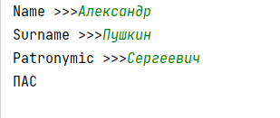

## [Задание 1.1 - 14 на 10](#task_1)
## [Задание 1.2 - Звёздный треугольник](#task_2)
## [Задание 1.3 - ФИО](#task_3)
## [Задание 1.4 - Сумма цифр](#task_4)


#### [_Ссылка на онлайн интерпретатор_](https://www.online-python.com/)
_________________________________________
_________________________________________

### Задание 1 - _14 на 10_ <a name="task_1"></a>
Напишите функцию `draw_box`, которая выводит звездный прямоугольник с размерами 
**14×10**


#### Пример вывода:
```shell
**********
*        *
*        *
*        *
*        *
*        *
*        *
*        *
*        *
*        *
*        *
*        *
*        *
**********
```

_________________________________________
_________________________________________
### Задание 2 - _Звёздный треугольник_<a name="task_2"></a> 
Напишите функцию `draw_triangle`, которая выводит звездный прямоугольный треугольник с катетами, 
равными **10** в соответствии с образцом:

#### Пример вывода::
```shell
*
**
***
****
*****
******
*******
********
*********
**********
```

**_Примечание:_** Для вывода треугольника используйте цикл for.


_________________________________________
_________________________________________
### Задание 3 - _ФИО_<a name="task_3"></a>
Напишите функцию `print_fio`, которая принимает три аргумента:

`name` – имя человека;  
`surname` – фамилия человека;  
`patronymic` – отчество человека;  

а затем выводит на печать ФИО человека.

**_Примечание:_** Предусмотрите тот факт, что все три буквы в ФИО должны иметь верхний регистр.

#### Пример программы:
> 

_________________________________________
_________________________________________
### Задание 4 - _Сумма цифр_<a name="task_4"></a>
Напишите функцию `print_digit_sum`, 
которая принимает одно целое число `num` и выводит на печать сумму его цифр.

#### Пример программы:
> 
> 
> 

_________________________________________
_________________________________________