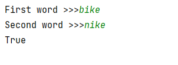
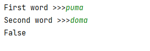
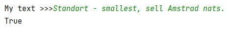
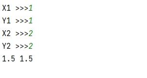

## [Задание 1.1 - Ты простое?](#task_1)
## [Задание 1.2 - Кто следующий простой](#task_2)
## [Задание 1.3 - Валидация пароля](#task_3)
## [Задание 1.4 - Почти одинаковые](#task_4)
## [Задание 1.5 - Валидация палиндрома](#task_5)
## [Задание 1.6 - Середина отрезка](#task_6)
## [Задание 1.7 - Параметры круга](#task_7)
## [Задание 1.8 - Решить квадратное уравнение](#task_8)


#### [_Ссылка на онлайн интерпретатор_](https://www.online-python.com/)
_________________________________________
_________________________________________

### Задание 1 - _Ты простое?_ <a name="task_1"></a>
Напишите функцию `is_prime`,  
которая принимает в качестве аргумента **натуральное число** и возвращает значение `True` 
если число является простым и `False` в противном случае.


#### Пример исполняемого кода:
```python
# your code here

print(is_prime(1))
print(is_prime(10))
print(is_prime(17))
```

#### Результат выполнения:
```shell
False
False
True
```

_________________________________________
_________________________________________
### Задание 2 - _Кто следующий простой_<a name="task_2"></a> 
Напишите функцию `get_next_prime`,  
которая принимает в качестве аргумента натуральное число **num** и 
возвращает первое простое число большее числа **num**.

**_Примечание:_** Используйте функцию `is_prime` из предыдущей задачи.


#### Пример исполняемого кода:
```python
# your code here

print(get_next_prime(6))
print(get_next_prime(7))
print(get_next_prime(14))
```

#### Результат выполнения:
```shell
7
11
17
```

_________________________________________
_________________________________________
### Задание 3 - _Валидация пароля_<a name="task_3"></a>
Напишите функцию `is_password_good`,  
которая принимает в качестве аргумента строковое значение пароля `password` и возвращает 
значение **True** если пароль является надежным и **False** в противном случае.

**Пароль является надежным если:**
- длина не менее 8 символов; 
- содержит как минимум одну заглавную букву (верхний регистр);
- содержит как минимум одну строчную букву (нижний регистр);
- содержит хотя бы одну цифру.

#### Пример исполняемого кода:
```python
# your code here

print(is_password_good('aabbCC11OP'))
print(is_password_good('abC1pu'))
```

#### Результат выполнения:
```shell
True
False
```

_________________________________________
_________________________________________
### Задание 4 - _Почти одинаковые_<a name="task_4"></a>
Напишите функцию `is_one_away`,  
которая принимает в качестве аргументов два слова `word1` и `word2` и возвращает значение **True** 
если слова имеют одинаковую длину и отличаются ровно в **1** символе и **False** в противном случае.

#### Пример исполняемого кода:
```python
# your code here

print(is_one_away('bike', 'hike'))
print(is_one_away('water', 'wafer'))
print(is_one_away('abcd', 'abpo'))
print(is_one_away('abcd', 'abcde'))
```

#### Результат выполнения:
```shell
True
True
False
False
```

#### Пример программы:
> 
> 
> 

_________________________________________
_________________________________________
### Задание 5 - _Валидация палиндрома_<a name="task_5"></a>
Напишите функцию `is_palindrome`,  
которая принимает в качестве аргумента строку `text` и возвращает значение **True**, 
если указанный текст является палиндромом и **False** в противном случае.

**_Примечания:_** 
- Палиндром – это строка, которая читается одинаково в обоих направлениях
- При проверке считайте большие и маленькие буквы одинаковыми, а также игнорируйте пробелы, а также символы `, . ! ? -.`

#### Пример исполняемого кода:
```python
# your code here

print(is_palindrome('А роза упала на лапу Азора.'))
print(is_palindrome('Gabler Ruby - burrel bag!'))
```

#### Результат выполнения:
```shell
True
True
```


#### Пример программы:
> 

_________________________________________
_________________________________________
### Задание 6 - _Середина отрезка_<a name="task_6"></a>
Напишите функцию `get_middle_point`,  
которая принимает в качестве аргументов координаты концов отрезка `x1`, `y1` и `x2`, `y2` и 
возвращает координаты точки являющейся серединой данного отрезка.

**_Примечание:_** Координаты середины отрезка с концами в точках **x1:y1** и **x2:y2** вычисляются 
по формуле: $${x_1 + x_2} \over 2$$ $${y_1 + y_2} \over 2$$

#### Пример исполняемого кода:
```python
# your code here

print(get_middle_point(0, 0, 10, 0))
print(get_middle_point(1, 5, 8, 3))
```

#### Результат выполнения:
```shell
5.0 0.0
4.5 4.0
```

#### Пример программы:
> 

_________________________________________
_________________________________________
### Задание 7 - _Параметры круга_<a name="task_7"></a>
Напишите функцию `get_circle`, 
которая принимает в качестве аргумента **радиус** окружности и возвращает два значения: 
- длину окружности 
- площадь круга, ограниченного данной окружностью.

**_Примечания:_** 
- Длина окружности и площадь круга радиуса r вычисляются по формулам:**P=2πr**, **S=πr** 
- Для числа **π** используйте глобальную константу из модуля **math**.


#### Пример исполняемого кода:
```python
# your code here

print(get_circle(1))
print(get_circle(1.5))
```

#### Результат выполнения:
```shell
6.283185307179586 3.141592653589793
9.42477796076938 7.0685834705770345
```

_________________________________________
_________________________________________
### Задание 8 - _Решить квадратное уравнение_<a name="task_8"></a>
Напишите функцию `solve`,  
которая принимает в качестве аргументов три целых числа **a**, **b**, **c** – коэффициенты квадратного уравнения 
`ax**2 +bx+c=0` и возвращает его корни в порядке возрастания.

**_Примечания:_** 
- С подобной задачей мы уже сталкивались.
- Гарантируется, что квадратное уравнение имеет корни.

#### Пример исполняемого кода:
```python
# your code here

print(solve(1, -4, -5))
print(solve(-2, 7, -5))
print(solve(1, 2, 1))
```

#### Результат выполнения:
```shell
-1.0 5.0
1.0 2.5
-1.0 -1.0
```
_________________________________________
_________________________________________