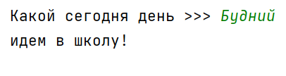

## [Задание 1.1 - Проверка пароля](#task_1)
## [Задание 1.2 - Чётный, нечётный](#task_2)
## [Задание 1.3 - Опять в школу](#task_3)
## [Задание 1.4 - Чистка зубов](#task_4)

#### [_Ссылка на онлайн интерпретатор_](https://www.online-python.com/)
_________________________________________
_________________________________________

### Задание 1 - _Проверка пароля_ <a name="task_1"></a>
При регистрации на сайтах требуется вводить пароль дважды. 
Это сделано для безопасности, поскольку такой подход уменьшает возможность неверного ввода пароля.

Напишите программу, которая сравнивает пароль и его подтверждение.
Если они совпадают, то программа выводит: ```Пароль принят```, иначе: ```Пароль не принят```.

**Формат входных данных:**   
На вход программе подаются две строки.

**Формат выходных данных:**   
Программа должна вывести одну строку в соответствии с условием задачи.


#### Примеры программы:


_________________________________________
_________________________________________
### Задание 2 - _Чётный, нечётный_<a name="task_2"></a>
Напишите программу, которая проверяет является ли число четным или нечетным.

**Формат входных данных**  
На вход программе одно целое число

**Формат выходных данных**  
Программа должна выводить сообщение о четности или нечетности числа 

#### Примеры программы:


_________________________________________
_________________________________________
### Задание 3 - _Опять в школу_<a name="task_3"></a>
Напишите программу, которая проверяет нужно ли идти сегодня в школу.

Если день является **будним** - вывести ```остаемся дома```, если день является **выходным** вывести - ```идем в школу!```

**Формат входных данных:**  
На вход программе одна текстовая переменная, содержащая выходной или будний 

**Формат выходных данных:**  
Программа должна вывести текст согласно условию задачи.


**_Примеры текста ввода_**:      
```Будний```     
```Выходной```

#### Пример программы:



_________________________________________
_________________________________________
### Задание 4 - _Чистка зубов_<a name="task_4"></a>
Напишите программу, которая проверяет нужно ли сегодня чистить зубы.

Если день является будним - вывести ```чистить зубы нужно```,  
если день является выходным вывести - ```Зубы надо чистить в любой день```


**Формат входных данных**  
На вход программе одна текстовая переменная, содержащая выходной или будний 
**Формат выходных данных**  
Программа должна вывести текст согласно условию задачи.

**_Примеры текста ввода_**:      
```Будний```     
```Выходной```

#### Пример программы:


_________________________________________
_________________________________________