## [Задание 2.1 - Идеальный численный треугольник](#task_1)
## [Задание 2.2 - Численный палиндромный треугольник](#task_2)
## [Задание 2.3 - Максимальная сумма делителей](#task_3)
## [Задание 2.4 - Гистограмма делителей](#task_4)
## [Задание 2.5 - Цифровой корень](#task_5)
## [Задание 2.6 - Сумма факториалов](#task_6)
## [Задание 2.7 - Где мои простые числа](#task_7)


#### [_Ссылка на онлайн интерпретатор_](https://www.online-python.com/)
_________________________________________
_________________________________________

### Задание 1 - _Идеальный численный треугольник_ <a name="task_1"></a>
На вход программе подается натуральное число **n**.  
Напишите программу, которая печатает численный треугольник в соответствии с примером:
```shell
1
2 3
4 5 6
7 8 9 10
11 12 13 14 15
16 17 18 19 20 21
```

**Формат входных данных**  
На вход программе подается одно натуральное число.

**Формат выходных данных**  
Программа должна вывести треугольник в соответствии с условием.


#### Примеры программы:
> 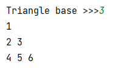
> 
> 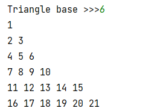

_________________________________________
_________________________________________
### Задание 2 - _Численный палиндромный треугольник_<a name="task_2"></a>
На вход программе подается натуральное число **n**.  
Напишите программу, которая печатает численный треугольник в соответствии с примером:
```shell
1
121
12321
1234321
123454321
```

**Формат входных данных**  
На вход программе подается одно натуральное число.

**Формат выходных данных**  
Программа должна вывести треугольник в соответствии с условием


#### Пример программы:
>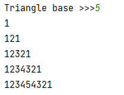
> 
> 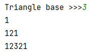

_________________________________________
_________________________________________
### Задание 3 - _Максимальная сумма делителей_<a name="task_3"></a>
На вход программе подается два натуральных числа **a** и **b** (_a < b_).   
Напишите программу, которая находит натуральное число из отрезка **[a;b]** с максимальной суммой 
делителей.

**Формат входных данных**  
На вход программе подаются два числа, каждое на отдельной строке

**Формат выходных данных**  
Программа должна вывести два числа на одной строке, разделенных пробелом: 
число с максимальной суммой делителей и сумму его делителей.


#### Пример программы:
> 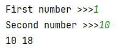
> 
> 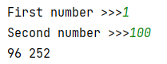

_________________________________________
_________________________________________
### Задание 4 - _Гистограмма делителей_<a name="task_4"></a>
На вход программе подается натуральное число **n**.  
Напишите программу, выводящую графическое изображение делимости чисел от **1** до **n** включительно. 
В каждой строке надо напечатать очередное число и столько символов «**+**», 
сколько делителей у этого числа.


**Формат входных данных**  
На вход программе подается одно натуральное число.

**Формат выходных данных**  
Программа должна вывести графическое изображение чисел от **1** до **n**, каждое на отдельной строке.

#### Пример программы:
>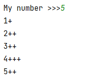
> 
>

_________________________________________
_________________________________________
### Задание 5 - _Цифровой корень_ <a name="task_5"></a>
На вход программе подается натуральное число **n**.  
Напишите программу, которая находит цифровой корень данного числа.   
Цифровой корень числа **n** получается следующим образом: 
если сложить все цифры этого числа, затем все цифры найденной суммы и повторить этот процесс, 
то в результате будет получено однозначное число (**цифра**), 
которое и называется цифровым корнем данного числа.


**Формат входных данных**  
На вход программе подается натуральное число.

**Формат выходных данных**  
Программа должна вывести цифровой корень введенного числа.

**_Примечание:_** Используйте вложенные циклы `while`.


#### Пример программы:
>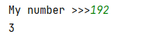
> 
>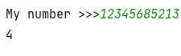

_________________________________________
_________________________________________
### Задание 6 - _Сумма факториалов_ <a name="task_6"></a>
Дано натуральное число **n**. 
Напишите программу, которая выводит значение суммы **_1!+2!+3!+…+n!_**.


**Формат входных данных**  
На вход программе подается натуральное число.

**Формат выходных данных**  
Программа должна вывести значение суммы **_1!+2!+3!+…+n!_**.

**_Примечание:_** **X!** - это факториал числа **X** который определяется как **_1x2x3xX_**. 
Т.е. достаточно перемножить все числа от 1 до **X**.
На заметку **_0! = 1_** 


#### Пример программы:
>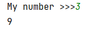
> 
>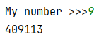

_________________________________________
_________________________________________
### Задание 7 - _Где мои простые числа_ <a name="task_7"></a>
На вход программе подается два натуральных числа **a** и **b** (_a < b_).   
Напишите программу, которая находит все простые числа от **a** до **b** включительно.


**Формат входных данных**  
На вход программе подаются два числа, каждое на отдельной строке.

**Формат выходных данных**  
Программа должна вывести все простые числа от **a** до **b** включительно, каждое на отдельной строке.


**_Примечание:_** Простое число это число которое делится только на единицу и на самого себя


#### Пример программы:
>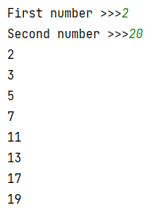

_________________________________________
_________________________________________