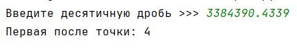

## [Задание 1.1 - Навстречу друг другу](#task_1)
## [Задание 1.2 - Инверсия](#task_2)
## [Задание 1.3 - 451 градус по Фаренгейту](#task_3)
## [Задание 1.4 - Собака тоже человек](#task_4)
## [Задание 1.5 - Первый после точки](#task_5)
## [Задание 1.6 - Все после точки](#task_6)
## [Задание 1.7 - Минимум и максимум](#task_7)
## [Задание 1.8 - К порядку](#task_8)
## [Задание 1.9 - Интересные числа](#task_9)

#### [_Ссылка на онлайн интерпретатор_](https://www.online-python.com/)
_________________________________________
_________________________________________

### Задание 1 - _Навстречу друг другу_ 
Из пунктов **А** и **В** навстречу друг другу выехали два автомобиля, 
с постоянными скоростями **V1** и **V2** **_км/ч_**.  
Определите через какое время старушки встретятся если расстояние между городами равно **S**. 

**Формат входных данных**  
На вход программе подаются три числа с плавающей точкой **S**, **V1**, **V2** каждое на отдельной строке.

**Формат выходных данных:**  
Программа должна вывести одно число в соответствии с условием задачи    

#### Примеры программы:
> 
> 
> 

_________________________________________
_________________________________________
### Задание 2 - _Инверсия_
Напишите программу, которая считывает с клавиатуры одно число и выводит обратное ему.  
Если при этом введенное с клавиатуры число – **ноль**, то вывести `Обратного числа не существует` (без кавычек)

**Формат входных данных**  
На вход программе подается число от 1 до 9 

**Формат выходных данных**  
Программа печатает таблицу сложения для всех чисел от **1** до **n**

**_Примечание:_** для числа **5** обратное число $$ 1/5 $$

#### Примеры программы:
> 
> 
> 

_________________________________________
_________________________________________
### Задание 3 - _451 градус по Фаренгейту_
У известного американского писателя *Рэя Бредбери* есть роман 
**«451 градус по Фаренгейту»**.  
Напишите программу, которая определяет, 
какой температуре по шкале Цельсия соответствует указанное значение по шкале Фаренгейта.

*Используйте формулу для перевода:* $$ C=(5/9) * (F - 32) $$

**Формат входных данных**  
На вход программе подаётся дробное число градусов по шкале Фаренгейта.

**Формат выходных данных:**  
Программа должна вывести число градусов по шкале Цельсия.

#### Пример программы:
> 
> 
> 

_________________________________________
_________________________________________
### Задание 4 - _Собака тоже человек_
На вход программе подается число **n** – количество собачьих лет.  
Напишите программу, которая вычисляет возраст собаки в человеческих годах.

**_Примечание:_** В течение **первых двух лет** собачий год равен **10.5** человеческим годам. 
После этого каждый год собаки равен **4** человеческим годам.

**Формат входных данных:**  
На вход программе подается натуральное число – количество собачьих лет.

**Формат выходных данных:**  
Программа должна вывести возраст собаки в человеческих годах.

#### Пример программы:
> 
> 
> 

_________________________________________
_________________________________________
### Задание 5 - _Первый после точки_
Дано положительное действительное число.  
Выведите его первую цифру после десятичной точки.

**Формат входных данных**  
На вход программе подается положительное действительное число.

**Формат выходных данных:**  
Программа должна вывести цифру в соответствии с условием задачи.

#### Пример программы:
> 
> 
> 

_________________________________________
_________________________________________
### Задание 6 - _Все после точки_
Дано положительное действительное число.   
Выведите его дробную часть.

**_Примечание:_** При определённых условиях решения результат может отличаться от ожидаемого, это связано
с тем, что число типа **float** хранит не абсолютно точное значение

**Формат входных данных**  
На вход программе подается положительное действительное число.

**Формат выходных данных:**  
Программа должна вывести дробную часть числа в соответствии с условием задачи.

#### Пример программы:
> 
> 
> 

_________________________________________
_________________________________________
### Задание 7 - _Минимум и максимум_
Напишите программу, которая находит наименьшее и наибольшее из пяти чисел.

**Формат входных данных**  
На вход программе подается пять целых чисел, каждое на отдельной строке.

**Формат выходных данных:**  
Программа должна вывести наименьшее и наибольшее число с поясняющей надписью.

#### Пример программы:
> 

_________________________________________
_________________________________________
### Задание 8 - _К порядку_
Напишите программу, которая упорядочивает три числа от большего к меньшему.

**Формат входных данных**  
На вход программе подается три целых числа, каждое на отдельной строке.

**Формат выходных данных:**  
Программа должна вывести три числа, каждое на отдельной строке, упорядоченных от большего к меньшему.

#### Пример программы:
> 

_________________________________________
_________________________________________
### Задание 9 - _Интересные числа_
Назовем число *интересным*, если в нем разность максимальной и минимальной цифры равняется 
средней по величине цифре.  
Напишите программу, которая определяет интересное число или нет. 
Если число интересное, следует вывести – `Число интересное` иначе `Число неинтересное`.

**Формат входных данных**  
На вход программе подается целое трехзначное число.

**Формат выходных данных:**  
Программа должна вывести текст в соответствии с условием задачи.

#### Пример программы:
> 
> 
> 

_________________________________________
_________________________________________