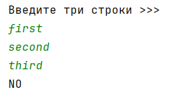

## [Задание 2.1 - I love Python](#task_1)
## [Задание 2.2 - Приветствие](#task_2)
## [Задание 2.3 - Длинный футбол](#task_3)
## [Задание 2.4 - Длинные города](#task_4)
## [Задание 2.5 - Арифметическая прогрессия](#task_5)
## [Задание 2.6 - Код синий](#task_6)
## [Задание 2.7 - Выходной](#task_7)
## [Задание 2.8 - Корректный email](#task_8)


#### [_Ссылка на онлайн интерпретатор_](https://www.online-python.com/)
_________________________________________
_________________________________________

### Задание 1 - _I love Python_ <a name="task_1"></a>
Напишите программу, которая выводит текст:  

```shell
"Python is a great language!", said Fred. "I don't ever remember having this much fun before."
```

**_Примечание:_** Используйте конкатенацию строк.


#### Примеры программы:
> 

_________________________________________
_________________________________________
### Задание 2 - _Приветствие_<a name="task_2"></a>
Напишите программу, которая считывает с клавиатуры две строки – имя и фамилию пользователя и выводит фразу:

`«Hello <введенное имя> <введенная фамилия>! You just delved into Python».`

**_Примечание:_** Между `firstname` и `lastname` вставьте пробел.


**Формат входных данных**  
На вход программе подаётся две строки (имя и фамилия), каждая на отдельной строке.

**Формат выходных данных**  
Программа должна вывести текст в соответствии с условием задачи.


#### Пример программы:
>
> 
> 

_________________________________________
_________________________________________
### Задание 3 - _Длинный футбол_<a name="task_3"></a>
Напишите программу, которая считывает с клавиатуры название футбольной команды и выводит фразу:  
`«Футбольная команда [введенная строка] имеет длину [длина введенной строки] символов».`

**Формат входных данных**  
На вход программе подается строка – название футбольной команды.

**Формат выходных данных**  
Программа должна вывести текст в соответствии с условием задачи.


#### Пример программы:
> 
> 
> 

_________________________________________
_________________________________________
### Задание 4 - _Длинные города_<a name="task_4"></a>
Даны названия трех городов. Напишите программу, которая определяет самое короткое и самое длинное название города.


**Формат входных данных**  
На вход программе подаётся названия трех городов, каждое на отдельной строке.

**Формат выходных данных**  
Программа должна вывести самое короткое и длинное название города, каждое на отдельной строке.

#### Пример программы:
>

_________________________________________
_________________________________________
### Задание 5 - _Арифметическая прогрессия_ <a name="task_5"></a>
Вводятся 3 строки в случайном порядке.  
Напишите программу, которая выясняет можно ли из длин этих строк построить возрастающую арифметическую прогрессию.


**Формат входных данных**  
На вход программе подаются три строки, каждая на отдельной строке.

**Формат выходных данных**  
Программа должна вывести строку `YES`, если из длин введенных слов можно построить арифметическую прогрессию,  
`NO` в ином случае.

#### Пример программы:
>
> 
>

_________________________________________
_________________________________________
### Задание 6 - _Код синий_ <a name="task_6"></a>
Напишите программу, которая считывает одну строку, после чего выводит `YES`, 
если в строке есть подстрока **синий** и `NO` в противном случае.


**Формат входных данных**  
На вход программе подается одна строка.

**Формат выходных данных**  
Программа должна вывести текст в соответствии с условием задачи. 


#### Пример программы:
>
> 
>

_________________________________________
_________________________________________
### Задание 7 - _Выходной_ <a name="task_7"></a>
Напишите программу, которая считывает одну строку, после чего выводит `YES`, 
если в строке есть подстрока **суббота** или **воскресенье**, и `NO` в противном случае


**Формат входных данных**  
На вход программе подается одна строка.

**Формат выходных данных**  
Программа должна вывести текст в соответствии с условием задачи.


#### Пример программы:
>
> 
> 

_________________________________________
_________________________________________
### Задание 8 - _Корректный email_ <a name="task_8"></a>
Будем считать email адрес корректным, если в нем есть символ собачки (**@**) и **точки**.  
Напишите программу проверяющую корректность **email** адреса.

**_Примечание:_** Наличие символов **@** и **.**,  
недостаточно для корректности *email* адреса, однако их отсутствие гарантированно влечет за собой неверный email.


**Формат входных данных**  
На вход программе подаётся одна строка – email адрес.

**Формат выходных данных**  
Программа должна вывести строку `YES`, если email адрес является корректным и `NO` в ином случае.

#### Пример программы:
>
> 
> 

_________________________________________
_________________________________________