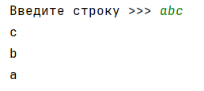
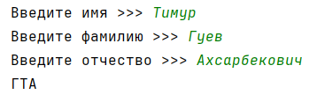

## [Задание 1.1 - Зеркальный столбик](#task_1)
## [Задание 1.2 - ФИО](#task_2)
## [Задание 1.3 - То ли строка, то ли число](#task_3)
## [Задание 1.4 - Я тебя найду](#task_4)
## [Задание 1.5 - Знаки наше всё](#task_5)
## [Задание 1.6 - Близнецы](#task_6)

#### [_Ссылка на онлайн интерпретатор_](https://www.online-python.com/)
_________________________________________
_________________________________________

### Задание 1 - _Зеркальный столбик_ 
На вход программе подается одна строка. 
Напишите программу, которая выводит в **столбик** элементы строки в обратном порядке.

**Формат входных данных**
На вход программе подается одна строка.

**Формат выходных данных:**  
Программа должна вывести в столбик элементы строки в обратном порядке.

#### Примеры программы:
> 
> 
> 

_________________________________________
_________________________________________
### Задание 2 - _ФИО_
На вход программе подаются три строки: **имя**, **фамилия** и **отчество**.  
Напишите программу, которая выводит инициалы человека.

**Формат входных данных**  
На вход программе подаются три строки, каждая на отдельной строке.

**Формат выходных данных**  
Программа должна вывести ФИО человека.

**_Примечание:_** Гарантируется, что имя, фамилия и отчество начинаются с заглавной буквы.

#### Примеры программы:
> 

_________________________________________
_________________________________________
### Задание 3 - _То ли строка, то ли число_
На вход программе подается **одна строка** состоящая из **цифр**. 
Напишите программу, которая считает сумму цифр данной строки.

**Формат входных данных**  
На вход программе подается одна строка состоящая из цифр.

**Формат выходных данных:**  
Программа должна вывести сумму цифр данной строки.

#### Пример программы:
> 
> 
> 

_________________________________________
_________________________________________
### Задание 4 - _Я тебя найду_
На вход программе подается одна строка.   
Напишите программу, которая выводит сообщение `«Цифра»` (*без кавычек*), если строка содержит цифру. 
В противном случае вывести сообщение `«Цифр нет»` (без кавычек).

**Формат входных данных:**  
На вход программе подается одна строка.

**Формат выходных данных:**  
Программа должна вывести текст в соответствии с условием задачи.

#### Пример программы:
> 
> 
> 

_________________________________________
_________________________________________
### Задание 5 - _Знаки наше всё_
На вход программе подается одна строка.  
Напишите программу, которая определяет сколько раз в строке встречаются символы `+` и `*`.

**Формат входных данных**  
На вход программе подается одна строка.

**Формат выходных данных:**  
Программа должна вывести сколько раз встречаются символы  `+` и `*` в строке.

#### Пример программы:
> 

_________________________________________
_________________________________________
### Задание 6 - _Близнецы_
На вход программе подается одна строка.   
Напишите программу, которая определяет сколько в ней одинаковых соседних символов.

**Формат входных данных**  
На вход программе подается одна строка

**Формат выходных данных:**  
Программа должна вывести количество одинаковых соседних символов.

#### Пример программы:
> 
> 
> 

_________________________________________
_________________________________________
