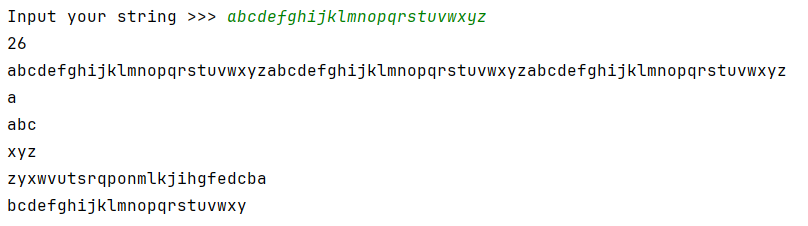

## [Задание 2.1 - Первая часть строки](#task_1)
## [Задание 2.2 - Последняя часть строки](#task_2)
## [Задание 2.3 - Палиндром](#task_3)
## [Задание 2.4 - Анализ строки](#task_4)
## [Задание 2.5 - Глубокий анализ строки](#task_5)
## [Задание 2.6 - Хитрые ножницы](#task_6)


#### [_Ссылка на онлайн интерпретатор_](https://www.online-python.com/)
_________________________________________
_________________________________________

### Задание 1 - _Часть строки_ <a name="task_1"></a>
Напишите код, используя срезы, так чтобы он вывел первые 12 символов строки `Папа у Васи - силен в математике`

```python
string = "Папа у Васи - силен в математике"
```

#### Примеры программы:
> 

_________________________________________
_________________________________________
### Задание 2 - _Последняя часть строки_<a name="task_2"></a>
Напишите код, используя срезы, так чтобы он вывел последние 10 символов строки `Папа у Васи - силен в математике`

```python
string = "Папа у Васи - силен в математике"
```


#### Пример программы:
>

_________________________________________
_________________________________________
### Задание 3 - _Палиндром_<a name="task_3"></a>
На вход программе подается одно слово, записанное в нижнем регистре.  
Напишите программу, которая определяет является ли оно **палиндромом**.

**Формат входных данных**  
На вход программе подается одно слово в нижнем регистре.

**Формат выходных данных**  
Программа должна вывести `«YES»`, если слово является палиндромом и `«NO»` в противном случае.


#### Пример программы:
> 
> 
> 

_________________________________________
_________________________________________
### Задание 4 - _Анализ строки_<a name="task_4"></a>
На вход программе подается одна строка.  
Напишите программу, которая выводит:

- общее количество символов в строке;
- исходную строку, повторенную **3** раза;
- *первый символ* строки;
- *первые три* символа строки;
- *последние три* символа строки;
- строку в обратном порядке;
- строку с удаленным первым и последним символ1ом.


**Формат входных данных**  
На вход программе подается одна строка, длина которой больше **3** символов.

**Формат выходных данных**  
Программа должна вывести данные в соответствии с условием. Каждое значение выводится на отдельной строке.

#### Пример программы:
>
> 
> 

_________________________________________
_________________________________________
### Задание 5 - _Глубокий анализ строки_ <a name="task_5"></a>
На вход программе подается одна строка. 
Напишите программу, которая выводит:

- **третий** символ этой строки;
- **предпоследний** символ этой строки;
- **первые пять** символов этой строки;
- всю строку, кроме **последних двух** символов;
- все символы с **четными** индексами;
- все символы с **нечетными** индексами;
- все символы в **обратном** порядке;
- все символы строки через один в **обратном** порядке, начиная с **последнего**.


**Формат входных данных**  
На вход программе подается одна строка, длина которой больше 5 символов.

**Формат выходных данных**  
Программа должна вывести данные в соответствии с условием. Каждое значение выводится на отдельной строке.

#### Пример программы:
>
> 
>

_________________________________________
_________________________________________
### Задание 6 - _Хитрые ножницы_ <a name="task_6"></a>
На вход программе подается строка текста.   
Напишите программу, которая разрежет ее на две равные части, переставит их местами и выведет на экран.

**Формат входных данных**  
На вход программе подается строка текста.

**Формат выходных данных**  
Программа должна вывести текст в соответствии с условием задачи.


#### Пример программы:
>
> 
>

_________________________________________
_________________________________________
